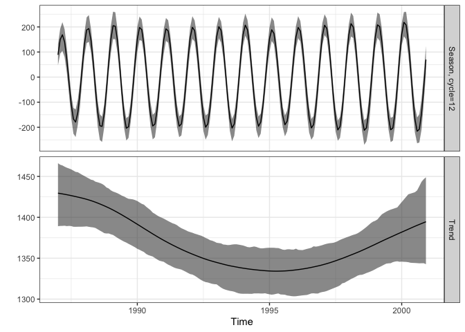
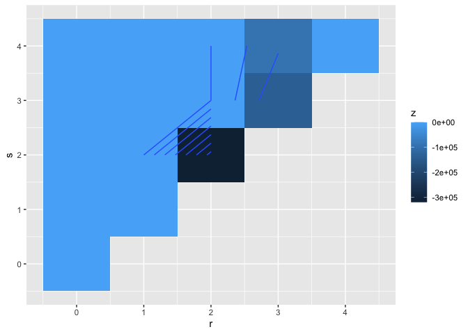
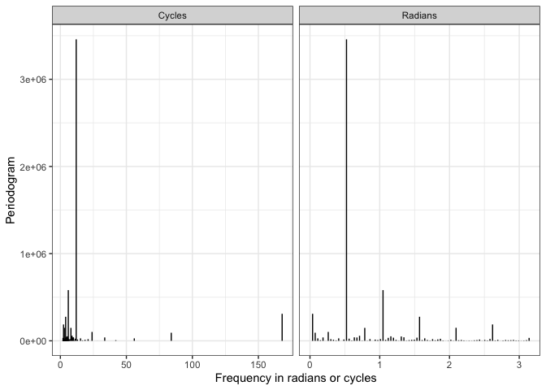

<!-- README.md is generated from README.Rmd. Please edit that file -->

# season 

<!-- badges: start -->

 
[](https://github.com/agbarnett/season/actions/workflows/R-CMD-check.yaml)
[](https://app.codecov.io/gh/agbarnett/season)
<!-- badges: end -->

R package to run seasonal analyses in time series. For details see our
book “Analysing Seasonal Health Data” (2010)
<https://www.springer.com/gp/book/9783642107474>.

# Installation

You can install `season` via the
[R-Universe](https://agbarnett.r-universe.dev/season)

``` r
install.packages('season', repos = c('https://agbarnett.r-universe.dev', 'https://cloud.r-project.org'))
```

# Example usage

``` r
library(season)
```

Useful functions of `season` are:

- `casecross()` for case-crossover analysis
- `nscosinor()` to estimate non-stationary seasonal patterns using the
  Kalman filter
- `nonlintest()` for a time domain test of non-linearity

Accompanying each of these functions are
[broom](https://broom.tidymodels.org/) tidiers (`tidy()`, `glance()`,
`augment()`), and some of the models have summary plots that you can see
using `autoplot()`

Let’s run a quick demonstration of these

## `casecross()`: case-crossover analysis

``` r
CVDdaily <- subset(CVDdaily, date <= as.Date('1987-12-31'))

head(CVDdaily)
#>          date cvd      dow  tmpd   o3mean   o3tmean Mon Tue Wed Thu Fri Sat
#> 3  1987-01-01  55 Thursday 54.50 -16.0073 -15.89619   0   0   0   1   0   0
#> 5  1987-01-02  73   Friday 58.50 -11.6595 -11.19102   0   0   0   0   1   0
#> 9  1987-01-03  64 Saturday 55.25 -10.3241 -10.51787   0   0   0   0   0   1
#> 12 1987-01-04  57   Sunday 54.75 -18.6471 -18.27014   0   0   0   0   0   0
#> 15 1987-01-05  56   Monday 54.50 -17.5291 -17.13201   1   0   0   0   0   0
#> 18 1987-01-06  65  Tuesday 49.75 -22.7846 -22.74711   0   1   0   0   0   0
#>    month winter spring summer autumn
#> 3      1      1      0      0      0
#> 5      1      1      0      0      0
#> 9      1      1      0      0      0
#> 12     1      1      0      0      0
#> 15     1      1      0      0      0
#> 18     1      1      0      0      0

# Effect of ozone on CVD death
casecross_cvd <- casecross(
  cvd ~ o3mean + tmpd + Mon + Tue + Wed + Thu + Fri + Sat,
  data = CVDdaily
)
summary(casecross_cvd)
#> Time-stratified case-crossover with a stratum length of 28 days
#> Total number of cases 17502 
#> Number of case days with available control days 364 
#> Average number of control days per case day 23.2 
#> 
#> Parameter Estimates:
#>                coef exp(coef)    se(coef)           z   Pr(>|z|)
#> o3mean -0.002882613 0.9971215 0.001128975 -2.55330077 0.01067073
#> tmpd    0.001461400 1.0014625 0.001981047  0.73769030 0.46070267
#> Mon     0.042733425 1.0436596 0.028942815  1.47647783 0.13981566
#> Tue     0.057910712 1.0596204 0.028772745  2.01269332 0.04414690
#> Wed    -0.010008025 0.9900419 0.029171937 -0.34307029 0.73154558
#> Thu    -0.016790296 0.9833499 0.029455877 -0.57001513 0.56866744
#> Fri     0.027247952 1.0276226 0.029173235  0.93400517 0.35030123
#> Sat     0.001855841 1.0018576 0.028900116  0.06421568 0.94879849

# broom tidiers
# tidy - one row per term, similar to `summary()`
tidy(casecross_cvd)
#> # A tibble: 8 × 5
#>   term   estimate std.error statistic p.value
#>   <chr>     <dbl>     <dbl>     <dbl>   <dbl>
#> 1 o3mean -0.00288   0.00113   -2.55    0.0107
#> 2 tmpd    0.00146   0.00198    0.738   0.461 
#> 3 Mon     0.0427    0.0289     1.48    0.140 
#> 4 Tue     0.0579    0.0288     2.01    0.0441
#> 5 Wed    -0.0100    0.0292    -0.343   0.732 
#> 6 Thu    -0.0168    0.0295    -0.570   0.569 
#> 7 Fri     0.0272    0.0292     0.934   0.350 
#> 8 Sat     0.00186   0.0289     0.0642  0.949
# glance - one row summary of model
glance(casecross_cvd)
#> # A tibble: 1 × 18
#>       n nevent statistic.log p.value.log statistic.sc p.value.sc statistic.wald
#>   <int>  <dbl>         <dbl>       <dbl>        <dbl>      <dbl>          <dbl>
#> 1  8815    365          20.4     0.00901         20.4    0.00888           20.4
#> # ℹ 11 more variables: p.value.wald <dbl>, statistic.robust <dbl>,
#> #   p.value.robust <dbl>, r.squared <dbl>, r.squared.max <dbl>,
#> #   concordance <dbl>, std.error.concordance <dbl>, logLik <dbl>, AIC <dbl>,
#> #   BIC <dbl>, nobs <dbl>

# augment - add model predictions back on to data
augment(casecross_cvd)
#> # A tibble: 8,815 × 15
#>    .rownames `Surv(timex, case)` o3mean  tmpd   Mon   Tue   Wed   Thu   Fri
#>    <chr>                  <Surv>  <dbl> <dbl> <dbl> <dbl> <dbl> <dbl> <dbl>
#>  1 3                           1  -16.0  54.5     0     0     0     1     0
#>  2 5                           1  -11.7  58.5     0     0     0     0     1
#>  3 9                           1  -10.3  55.2     0     0     0     0     0
#>  4 12                          1  -18.6  54.8     0     0     0     0     0
#>  5 15                          1  -17.5  54.5     1     0     0     0     0
#>  6 18                          1  -22.8  49.8     0     1     0     0     0
#>  7 21                          1  -19.1  53.5     0     0     1     0     0
#>  8 24                          1  -18.5  52.5     0     0     0     1     0
#>  9 27                          1  -17.3  54       0     0     0     0     1
#> 10 30                          1  -14.2  56       0     0     0     0     0
#> # ℹ 8,805 more rows
#> # ℹ 6 more variables: Sat <dbl>, `strata(time)` <fct>, `(weights)` <int>,
#> #   .fitted <dbl>, .se.fit <dbl>, .resid <dbl>
```

## `nscosinor()` to estimate non-stationary seasonal patterns using the Kalman filter

``` r
f <- c(12)
tau <- c(10, 50)
res12 <- nscosinor(
  data = CVD,
  response = 'adj',
  cycles = f,
  niters = 200,
  burnin = 50,
  tau = tau
)
#> Iteration number 50 of 200 Iteration number 100 of 200 Iteration number 150 of 200 Iteration number 200 of 200 
summary(res12)
#> Statistics for non-stationary cosinor based on MCMC chains
#> Number of MCMC samples = 151
#> 
#> Standard deviations
#> Residual, mean=115.241, 95% CI [100.978, 133.356]
#> Cycle=12
#> Season, mean=0.0985381, 95% CI [0.0681559, 0.146523]
#> 
#> Phase and amplitude
#> Cycle=12
#> Amplitude, mean=202.506, 95% CI [181.455, 225.563]
#> Phase (radians), mean=0.703173, 95% CI [0.601867, 0.816469]

# broom tidiers
tidy(res12)
#> # A tibble: 4 × 4
#>   term            mean    lower   upper
#>   <chr>          <dbl>    <dbl>   <dbl>
#> 1 std.error   115.     101.     133.   
#> 2 std.season1   0.0985   0.0682   0.147
#> 3 phase1        0.703    0.602    0.816
#> 4 amplitude1  203.     181.     226.

autoplot(res12)
```



## `nonlintest()` for a time domain test of non-linearity

``` r
test_res <- nonlintest(data = CVD$cvd, n.lag = 4, n.boot = 1000)
test_res
#> Largest and smallest co-ordinates of the third-order moment outside the test limits
#> Largest difference is zero
#> Largest negative difference at lags:
#> 2 2 
#> Size of largest negative difference:
#> -318975.4 
#> 
#> Bootstrap test of non-linearity using the third-order moment
#> Statistics for areas outside test limits:
#> observed     obs/SD     median-null    95%-null    p-value
#> 552361.8 0.932211 0 1406467 0.149
autoplot(test_res)
```



## Other helper functions

use `invyrfraction_num/chr` to invert a fraction of the year or hour to
a useful time scale:

``` r
year_frac <- c(0, 0.5, 0.99)
invyrfraction_num(year_frac, type = "weekly")
#> [1]  1.00 27.00 52.48
invyrfraction_chr(year_frac, type = "weekly")
#> [1] "Week = 1"    "Week = 27"   "Week = 52.5"

invyrfraction_num(year_frac, type = "daily")
#> [1]   1.0000 183.6250 362.5975
invyrfraction_chr(year_frac, type = "daily")
#> [1] "Month = January , day = 1"   "Month = July , day = 2"     
#> [3] "Month = December , day = 28"

invyrfraction_num(year_frac, type = "monthly")
#> [1]  1.00  7.00 12.88
invyrfraction_chr(year_frac, type = "monthly")
#> [1] "Month = 1"    "Month = 7"    "Month = 12.9"
```

Estimate a periodogram using the fast Fourier transform (`fft`).

``` r
p <- peri(CVD$cvd)
p
#> # A tibble: 85 × 5
#>        peri freq_radians freq_cycles      amp phase
#>       <dbl>        <dbl>       <dbl>    <dbl> <dbl>
#>  1 6.30e-25       0             NA   8.66e-14 0    
#>  2 3.10e+ 5       0.0374       168   6.07e+ 1 0.357
#>  3 9.27e+ 4       0.0748        84   3.32e+ 1 0.641
#>  4 2.83e+ 4       0.112         56   1.83e+ 1 2.12 
#>  5 7.04e+ 3       0.150         42   9.16e+ 0 2.96 
#>  6 3.85e+ 4       0.187         33.6 2.14e+ 1 3.23 
#>  7 4.46e+ 2       0.224         28   2.30e+ 0 1.65 
#>  8 1.02e+ 5       0.262         24   3.48e+ 1 2.70 
#>  9 1.90e+ 4       0.299         21   1.50e+ 1 0.846
#> 10 1.18e+ 4       0.337         18.7 1.18e+ 1 2.45 
#> # ℹ 75 more rows
autoplot(p)
```



For full details see the [season website]().
