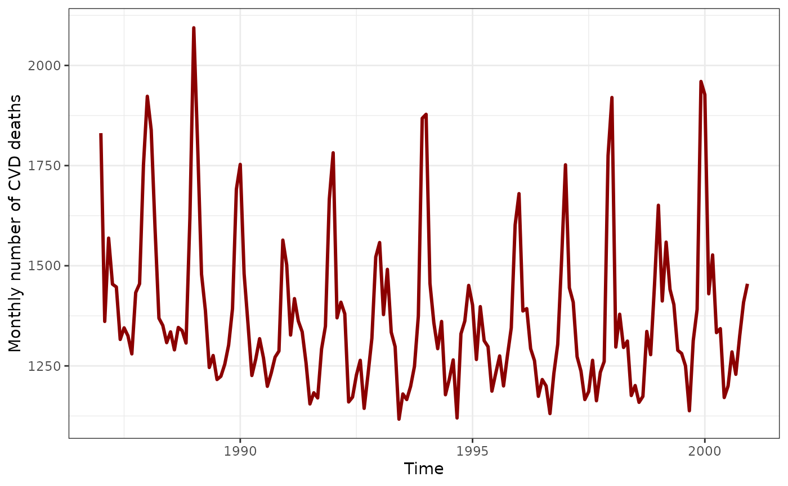
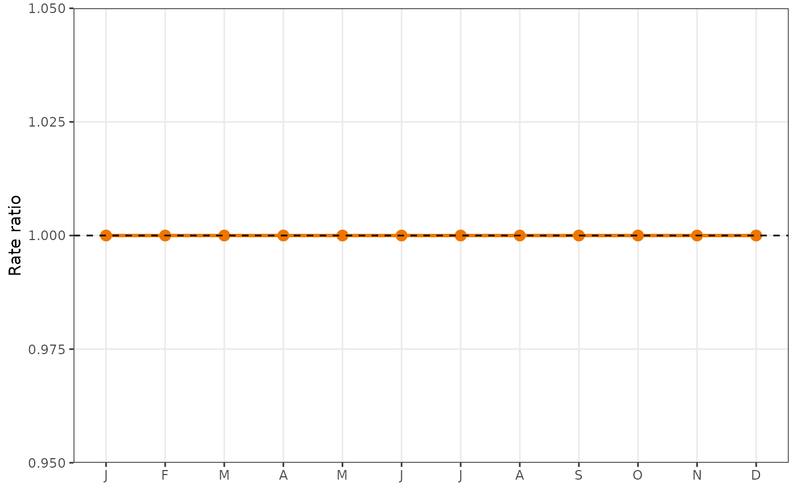
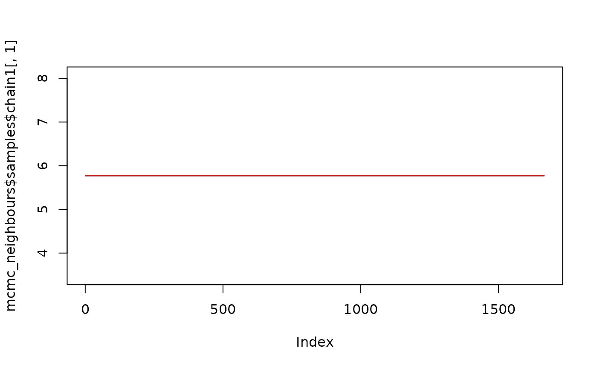
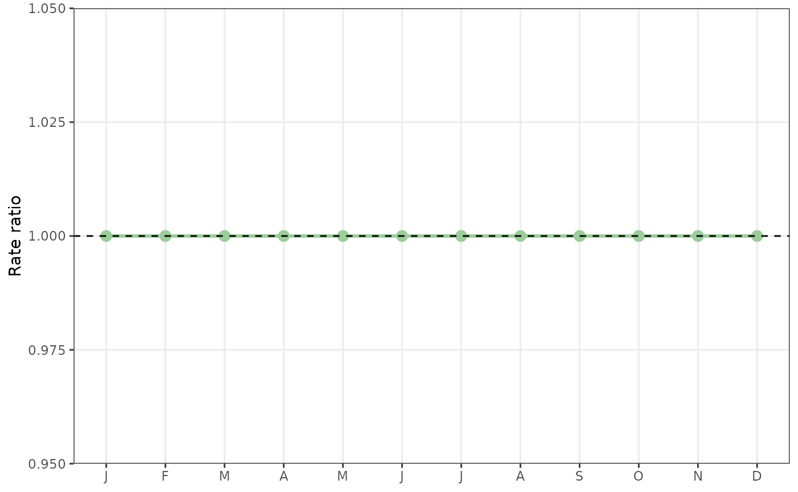

# Modelling monthly data

## Monthly data

Time series data are often collected as monthly counts, for example, the
monthly number of deaths or hospital admissions. In this vignette we
will use the monthly number of deaths from cardiovascular disease (CVD)
in people aged 75 and over in Los-Angeles for the years 1987 to 2000
($`n=168`$ observations). We will compare three models for examining a
seasonal pattern using month.

First we load the data and then use `ggplot2` to draw a lineplot of the
monthly death counts over time.

``` r

ggplot(CVD, aes(x = yrmon, y = cvd)) +
  geom_line(colour = 'darkred', linewidth = 1.05) +
  labs(
    x = "Time",
    y = "Monthly number of CVD deaths"
  ) +
  theme_bw()
```



There is a clear seasonal pattern, with more deaths in the winter months
and fewer in the summer.

## Month as a fixed effect

In the first model, we treat each month as a separate category with a
fixed parameter.

``` r

model1 <- monthglm(
  formula = cvd ~ 1,
  data = CVD,
  family = quasipoisson(),
  offsetpop = expression(pop / 100000),
  offsetmonth = TRUE,
  refmonth = 6
)
plot(model1, ylab = 'Rate ratio')
#> Warning: `plot.monthglm()` was deprecated in season 0.3.17.
#> Use `autoplot()` for a ggplot object you can extend:
#> ℹ  autoplot(x) + ggplot2::labs(x = ..., y = ...)
#> This warning is displayed once per session.
#> Call `lifecycle::last_lifecycle_warnings()` to see where this warning was
#> generated.
```


The outcome is counts, so it is best to use a Poisson distribution.
Using the `family = quasipoisson` instead of `family = poisson` accounts
for any over-dispersion in the data, where the variance in counts is
greater than the mean. Without acknowledging this over-dispersion, the
confidence intervals for the estimated effects would be too narrow. You
can see this if you change the `quasipoisson` to `poisson`.

We adjust for the population size using an offset scaled to 100,000
people. This is useful for adjusting for changes over time in the
population size.

We also adjust for the varying number of days in the month using the
`offsetmonth=TRUE` option as longer months will have more deaths on
average than shorter months (e.g., January vs February).

The estimates in the plot are rate ratios. We used June as the reference
month, so the rate ratio in this month is 1. The plot shows a typical
seasonal pattern with a winter increase in deaths that peaks in January
(around 40% higher than June).

## Month as a random effect

Next we fit month as a random instead of fixed effect. This allows the
monthly estimates to follow a distribution. The distribution most often
used for random effects is the Normal distribution.

To fit the random effects model we switch to a Bayesian approach using
the `nimble` package.

``` r

code_random_month <- nimbleCode({
  ## Likelihood
  for (i in 1:N) {
    # loop through time
    cvd[i] ~ dpois(mu[i])
    log(mu[i]) <- log(offset[i]) + log(n_days_month[i]) + alpha + beta.c[month[i]]
  }
  # priors
  alpha ~ dnorm(0, sd = 100)
  for (k in 1:12) {
    beta[k] ~ dnorm(0, tau = tau.month)
    beta.c[k] <- beta[k] - mean.beta
  }
  mean.beta <- mean(beta[1:12])
  tau.month ~ dgamma(1, 1)
  # rescale to standard deviation
  sigma.month <- 1 / sqrt(tau.month) 
})
```

As before, we assume that the counts follow a Poisson distribution. We
have two offsets, one for the population and one for the days of the
month.

Each month is fitted as a random effect centred on zero. The ensure that
the month effects sum to zero, we create a centred version by
subtracting the mean.

Next we set up the data ready for `nimble` to use. The number of days in
each month are scaled to a 30 day month.

``` r

constants <- list(
  N = nrow(CVD),
  month = CVD$month,
  # scaled to per 100,000 people
  offset = CVD$pop / 100000,
  # scaled to per 30 days
  n_days_month = (CVD$n_days_month) / 30
)
data <- list(cvd = CVD$cvd)
```

Next we create the initial values to get the chains started, using an
estimate of the mean for the intercept.

``` r

inits <- list(
  tau.month = 1,
  alpha = log(mean(CVD$cvd / (CVD$pop / 100000))),
  beta = rep(0, 12)
)
```

Next we run the Markov chain Monte Carlo (MCMC) estimates using two
chains. We plot the samples for both chains for the intercept as a quick
check that the estimates have converged.

``` r

# parameters to store
parms <- c('alpha', 'beta.c', 'sigma.month')
# define the model
model <- nimbleModel(
  code_random_month,
  data = data,
  inits = inits,
  constants = constants
)
#> Defining model
#> Building model
#> Setting data and initial values
#> Running calculate on model
#>   [Note] Any error reports that follow may simply reflect missing values in model variables.
#> Checking model sizes and dimensions
#>   [Note] This model is not fully initialized. This is not an error.
#>          To see which variables are not initialized, use model$initializeInfo().
#>          For more information on model initialization, see help(modelInitialization).
# MCMC samples
thin <- 3
MCMC <- 1000
mcmc_random <- nimbleMCMC(
  model = model,
  inits = inits,
  monitors = parms,
  # times 2 for burn-in
  niter = MCMC * 2 * thin, 
  thin = thin,
  nchains = 2,
  nburnin = MCMC,
  summary = TRUE,
  # one seed per chain
  setSeed = c(1, 2), 
  WAIC = TRUE
)
#> Compiling
#>   [Note] This may take a minute.
#>   [Note] Use 'showCompilerOutput = TRUE' to see C++ compilation details.
#> running chain 1...
#> warning: value of deterministic node mu[1]: value is NA or NaN even after trying to calculate.
#> warning: value of deterministic node mu[13]: value is NA or NaN even after trying to calculate.
#> warning: value of deterministic node mu[25]: value is NA or NaN even after trying to calculate.
#> warning: value of deterministic node mu[37]: value is NA or NaN even after trying to calculate.
#> warning: value of deterministic node mu[49]: value is NA or NaN even after trying to calculate.
#> warning: value of deterministic node mu[61]: value is NA or NaN even after trying to calculate.
#> warning: value of deterministic node mu[73]: value is NA or NaN even after trying to calculate.
#> warning: value of deterministic node mu[85]: value is NA or NaN even after trying to calculate.
#> warning: value of deterministic node mu[97]: value is NA or NaN even after trying to calculate.
#> warning: value of deterministic node mu[109]: value is NA or NaN even after trying to calculate.
#> warning: value of deterministic node mu[121]: value is NA or NaN even after trying to calculate.
#> warning: value of deterministic node mu[133]: value is NA or NaN even after trying to calculate.
#> warning: value of deterministic node mu[145]: value is NA or NaN even after trying to calculate.
#> warning: value of deterministic node mu[157]: value is NA or NaN even after trying to calculate.
#> warning: value of deterministic node mu[2]: value is NA or NaN even after trying to calculate.
#> warning: value of deterministic node mu[14]: value is NA or NaN even after trying to calculate.
#> warning: value of deterministic node mu[26]: value is NA or NaN even after trying to calculate.
#> warning: value of deterministic node mu[38]: value is NA or NaN even after trying to calculate.
#> warning: value of deterministic node mu[50]: value is NA or NaN even after trying to calculate.
#> warning: value of deterministic node mu[62]: value is NA or NaN even after trying to calculate.
#> warning: value of deterministic node mu[74]: value is NA or NaN even after trying to calculate.
#> warning: value of deterministic node mu[86]: value is NA or NaN even after trying to calculate.
#> warning: value of deterministic node mu[98]: value is NA or NaN even after trying to calculate.
#> warning: value of deterministic node mu[110]: value is NA or NaN even after trying to calculate.
#> warning: value of deterministic node mu[122]: value is NA or NaN even after trying to calculate.
#> warning: value of deterministic node mu[134]: value is NA or NaN even after trying to calculate.
#> warning: value of deterministic node mu[146]: value is NA or NaN even after trying to calculate.
#> warning: value of deterministic node mu[158]: value is NA or NaN even after trying to calculate.
#> warning: value of deterministic node mu[3]: value is NA or NaN even after trying to calculate.
#> warning: value of deterministic node mu[15]: value is NA or NaN even after trying to calculate.
#> warning: value of deterministic node mu[27]: value is NA or NaN even after trying to calculate.
#> warning: value of deterministic node mu[39]: value is NA or NaN even after trying to calculate.
#> warning: value of deterministic node mu[51]: value is NA or NaN even after trying to calculate.
#> warning: value of deterministic node mu[63]: value is NA or NaN even after trying to calculate.
#> warning: value of deterministic node mu[75]: value is NA or NaN even after trying to calculate.
#> warning: value of deterministic node mu[87]: value is NA or NaN even after trying to calculate.
#> warning: value of deterministic node mu[99]: value is NA or NaN even after trying to calculate.
#> warning: value of deterministic node mu[111]: value is NA or NaN even after trying to calculate.
#> warning: value of deterministic node mu[123]: value is NA or NaN even after trying to calculate.
#> warning: value of deterministic node mu[135]: value is NA or NaN even after trying to calculate.
#> warning: value of deterministic node mu[147]: value is NA or NaN even after trying to calculate.
#> warning: value of deterministic node mu[159]: value is NA or NaN even after trying to calculate.
#> warning: value of deterministic node mu[4]: value is NA or NaN even after trying to calculate.
#> warning: value of deterministic node mu[16]: value is NA or NaN even after trying to calculate.
#> warning: value of deterministic node mu[28]: value is NA or NaN even after trying to calculate.
#> warning: value of deterministic node mu[40]: value is NA or NaN even after trying to calculate.
#> warning: value of deterministic node mu[52]: value is NA or NaN even after trying to calculate.
#> warning: value of deterministic node mu[64]: value is NA or NaN even after trying to calculate.
#> warning: value of deterministic node mu[76]: value is NA or NaN even after trying to calculate.
#> warning: value of deterministic node mu[88]: value is NA or NaN even after trying to calculate.
#> warning: value of deterministic node mu[100]: value is NA or NaN even after trying to calculate.
#> warning: value of deterministic node mu[112]: value is NA or NaN even after trying to calculate.
#> warning: value of deterministic node mu[124]: value is NA or NaN even after trying to calculate.
#> warning: value of deterministic node mu[136]: value is NA or NaN even after trying to calculate.
#> warning: value of deterministic node mu[148]: value is NA or NaN even after trying to calculate.
#> warning: value of deterministic node mu[160]: value is NA or NaN even after trying to calculate.
#> warning: value of deterministic node mu[5]: value is NA or NaN even after trying to calculate.
#> warning: value of deterministic node mu[17]: value is NA or NaN even after trying to calculate.
#> warning: value of deterministic node mu[29]: value is NA or NaN even after trying to calculate.
#> warning: value of deterministic node mu[41]: value is NA or NaN even after trying to calculate.
#> warning: value of deterministic node mu[53]: value is NA or NaN even after trying to calculate.
#> warning: value of deterministic node mu[65]: value is NA or NaN even after trying to calculate.
#> warning: value of deterministic node mu[77]: value is NA or NaN even after trying to calculate.
#> warning: value of deterministic node mu[89]: value is NA or NaN even after trying to calculate.
#> warning: value of deterministic node mu[101]: value is NA or NaN even after trying to calculate.
#> warning: value of deterministic node mu[113]: value is NA or NaN even after trying to calculate.
#> warning: value of deterministic node mu[125]: value is NA or NaN even after trying to calculate.
#> warning: value of deterministic node mu[137]: value is NA or NaN even after trying to calculate.
#> warning: value of deterministic node mu[149]: value is NA or NaN even after trying to calculate.
#> warning: value of deterministic node mu[161]: value is NA or NaN even after trying to calculate.
#> warning: value of deterministic node mu[6]: value is NA or NaN even after trying to calculate.
#> warning: value of deterministic node mu[18]: value is NA or NaN even after trying to calculate.
#> warning: value of deterministic node mu[30]: value is NA or NaN even after trying to calculate.
#> warning: value of deterministic node mu[42]: value is NA or NaN even after trying to calculate.
#> warning: value of deterministic node mu[54]: value is NA or NaN even after trying to calculate.
#> warning: value of deterministic node mu[66]: value is NA or NaN even after trying to calculate.
#> warning: value of deterministic node mu[78]: value is NA or NaN even after trying to calculate.
#> warning: value of deterministic node mu[90]: value is NA or NaN even after trying to calculate.
#> warning: value of deterministic node mu[102]: value is NA or NaN even after trying to calculate.
#> warning: value of deterministic node mu[114]: value is NA or NaN even after trying to calculate.
#> warning: value of deterministic node mu[126]: value is NA or NaN even after trying to calculate.
#> warning: value of deterministic node mu[138]: value is NA or NaN even after trying to calculate.
#> warning: value of deterministic node mu[150]: value is NA or NaN even after trying to calculate.
#> warning: value of deterministic node mu[162]: value is NA or NaN even after trying to calculate.
#> warning: value of deterministic node mu[7]: value is NA or NaN even after trying to calculate.
#> warning: value of deterministic node mu[19]: value is NA or NaN even after trying to calculate.
#> warning: value of deterministic node mu[31]: value is NA or NaN even after trying to calculate.
#> warning: value of deterministic node mu[43]: value is NA or NaN even after trying to calculate.
#> warning: value of deterministic node mu[55]: value is NA or NaN even after trying to calculate.
#> warning: value of deterministic node mu[67]: value is NA or NaN even after trying to calculate.
#> warning: value of deterministic node mu[79]: value is NA or NaN even after trying to calculate.
#> warning: value of deterministic node mu[91]: value is NA or NaN even after trying to calculate.
#> warning: value of deterministic node mu[103]: value is NA or NaN even after trying to calculate.
#> warning: value of deterministic node mu[115]: value is NA or NaN even after trying to calculate.
#> warning: value of deterministic node mu[127]: value is NA or NaN even after trying to calculate.
#> warning: value of deterministic node mu[139]: value is NA or NaN even after trying to calculate.
#> warning: value of deterministic node mu[151]: value is NA or NaN even after trying to calculate.
#> warning: value of deterministic node mu[163]: value is NA or NaN even after trying to calculate.
#> warning: value of deterministic node mu[8]: value is NA or NaN even after trying to calculate.
#> warning: value of deterministic node mu[20]: value is NA or NaN even after trying to calculate.
#> warning: value of deterministic node mu[32]: value is NA or NaN even after trying to calculate.
#> warning: value of deterministic node mu[44]: value is NA or NaN even after trying to calculate.
#> warning: value of deterministic node mu[56]: value is NA or NaN even after trying to calculate.
#> warning: value of deterministic node mu[68]: value is NA or NaN even after trying to calculate.
#> warning: value of deterministic node mu[80]: value is NA or NaN even after trying to calculate.
#> warning: value of deterministic node mu[92]: value is NA or NaN even after trying to calculate.
#> warning: value of deterministic node mu[104]: value is NA or NaN even after trying to calculate.
#> warning: value of deterministic node mu[116]: value is NA or NaN even after trying to calculate.
#> warning: value of deterministic node mu[128]: value is NA or NaN even after trying to calculate.
#> warning: value of deterministic node mu[140]: value is NA or NaN even after trying to calculate.
#> warning: value of deterministic node mu[152]: value is NA or NaN even after trying to calculate.
#> warning: value of deterministic node mu[164]: value is NA or NaN even after trying to calculate.
#> warning: value of deterministic node mu[9]: value is NA or NaN even after trying to calculate.
#> warning: value of deterministic node mu[21]: value is NA or NaN even after trying to calculate.
#> warning: value of deterministic node mu[33]: value is NA or NaN even after trying to calculate.
#> warning: value of deterministic node mu[45]: value is NA or NaN even after trying to calculate.
#> warning: value of deterministic node mu[57]: value is NA or NaN even after trying to calculate.
#> warning: value of deterministic node mu[69]: value is NA or NaN even after trying to calculate.
#> warning: value of deterministic node mu[81]: value is NA or NaN even after trying to calculate.
#> warning: value of deterministic node mu[93]: value is NA or NaN even after trying to calculate.
#> warning: value of deterministic node mu[105]: value is NA or NaN even after trying to calculate.
#> warning: value of deterministic node mu[117]: value is NA or NaN even after trying to calculate.
#> warning: value of deterministic node mu[129]: value is NA or NaN even after trying to calculate.
#> warning: value of deterministic node mu[141]: value is NA or NaN even after trying to calculate.
#> warning: value of deterministic node mu[153]: value is NA or NaN even after trying to calculate.
#> warning: value of deterministic node mu[165]: value is NA or NaN even after trying to calculate.
#> warning: value of deterministic node mu[10]: value is NA or NaN even after trying to calculate.
#> warning: value of deterministic node mu[22]: value is NA or NaN even after trying to calculate.
#> warning: value of deterministic node mu[34]: value is NA or NaN even after trying to calculate.
#> warning: value of deterministic node mu[46]: value is NA or NaN even after trying to calculate.
#> warning: value of deterministic node mu[58]: value is NA or NaN even after trying to calculate.
#> warning: value of deterministic node mu[70]: value is NA or NaN even after trying to calculate.
#> warning: value of deterministic node mu[82]: value is NA or NaN even after trying to calculate.
#> warning: value of deterministic node mu[94]: value is NA or NaN even after trying to calculate.
#> warning: value of deterministic node mu[106]: value is NA or NaN even after trying to calculate.
#> warning: value of deterministic node mu[118]: value is NA or NaN even after trying to calculate.
#> warning: value of deterministic node mu[130]: value is NA or NaN even after trying to calculate.
#> warning: value of deterministic node mu[142]: value is NA or NaN even after trying to calculate.
#> warning: value of deterministic node mu[154]: value is NA or NaN even after trying to calculate.
#> warning: value of deterministic node mu[166]: value is NA or NaN even after trying to calculate.
#> warning: value of deterministic node mu[11]: value is NA or NaN even after trying to calculate.
#> warning: value of deterministic node mu[23]: value is NA or NaN even after trying to calculate.
#> warning: value of deterministic node mu[35]: value is NA or NaN even after trying to calculate.
#> warning: value of deterministic node mu[47]: value is NA or NaN even after trying to calculate.
#> warning: value of deterministic node mu[59]: value is NA or NaN even after trying to calculate.
#> warning: value of deterministic node mu[71]: value is NA or NaN even after trying to calculate.
#> warning: value of deterministic node mu[83]: value is NA or NaN even after trying to calculate.
#> warning: value of deterministic node mu[95]: value is NA or NaN even after trying to calculate.
#> warning: value of deterministic node mu[107]: value is NA or NaN even after trying to calculate.
#> warning: value of deterministic node mu[119]: value is NA or NaN even after trying to calculate.
#> warning: value of deterministic node mu[131]: value is NA or NaN even after trying to calculate.
#> warning: value of deterministic node mu[143]: value is NA or NaN even after trying to calculate.
#> warning: value of deterministic node mu[155]: value is NA or NaN even after trying to calculate.
#> warning: value of deterministic node mu[167]: value is NA or NaN even after trying to calculate.
#> warning: value of deterministic node mu[12]: value is NA or NaN even after trying to calculate.
#> warning: value of deterministic node mu[24]: value is NA or NaN even after trying to calculate.
#> warning: value of deterministic node mu[36]: value is NA or NaN even after trying to calculate.
#> warning: value of deterministic node mu[48]: value is NA or NaN even after trying to calculate.
#> warning: value of deterministic node mu[60]: value is NA or NaN even after trying to calculate.
#> warning: value of deterministic node mu[72]: value is NA or NaN even after trying to calculate.
#> warning: value of deterministic node mu[84]: value is NA or NaN even after trying to calculate.
#> warning: value of deterministic node mu[96]: value is NA or NaN even after trying to calculate.
#> warning: value of deterministic node mu[108]: value is NA or NaN even after trying to calculate.
#> warning: value of deterministic node mu[120]: value is NA or NaN even after trying to calculate.
#> warning: value of deterministic node mu[132]: value is NA or NaN even after trying to calculate.
#> warning: value of deterministic node mu[144]: value is NA or NaN even after trying to calculate.
#> warning: value of deterministic node mu[156]: value is NA or NaN even after trying to calculate.
#> warning: value of deterministic node mu[168]: value is NA or NaN even after trying to calculate.
#> warning: logProb of data node cvd[1]: logProb is NA or NaN.
#> warning: logProb of data node cvd[13]: logProb is NA or NaN.
#> warning: logProb of data node cvd[25]: logProb is NA or NaN.
#> warning: logProb of data node cvd[37]: logProb is NA or NaN.
#> warning: logProb of data node cvd[49]: logProb is NA or NaN.
#> warning: logProb of data node cvd[61]: logProb is NA or NaN.
#> warning: logProb of data node cvd[73]: logProb is NA or NaN.
#> warning: logProb of data node cvd[85]: logProb is NA or NaN.
#> warning: logProb of data node cvd[97]: logProb is NA or NaN.
#> warning: logProb of data node cvd[109]: logProb is NA or NaN.
#> warning: logProb of data node cvd[121]: logProb is NA or NaN.
#> warning: logProb of data node cvd[133]: logProb is NA or NaN.
#> warning: logProb of data node cvd[145]: logProb is NA or NaN.
#> warning: logProb of data node cvd[157]: logProb is NA or NaN.
#> warning: logProb of data node cvd[2]: logProb is NA or NaN.
#> warning: logProb of data node cvd[14]: logProb is NA or NaN.
#> warning: logProb of data node cvd[26]: logProb is NA or NaN.
#> warning: logProb of data node cvd[38]: logProb is NA or NaN.
#> warning: logProb of data node cvd[50]: logProb is NA or NaN.
#> warning: logProb of data node cvd[62]: logProb is NA or NaN.
#> warning: logProb of data node cvd[74]: logProb is NA or NaN.
#> warning: logProb of data node cvd[86]: logProb is NA or NaN.
#> warning: logProb of data node cvd[98]: logProb is NA or NaN.
#> warning: logProb of data node cvd[110]: logProb is NA or NaN.
#> warning: logProb of data node cvd[122]: logProb is NA or NaN.
#> warning: logProb of data node cvd[134]: logProb is NA or NaN.
#> warning: logProb of data node cvd[146]: logProb is NA or NaN.
#> warning: logProb of data node cvd[158]: logProb is NA or NaN.
#> warning: logProb of data node cvd[3]: logProb is NA or NaN.
#> warning: logProb of data node cvd[15]: logProb is NA or NaN.
#> warning: logProb of data node cvd[27]: logProb is NA or NaN.
#> warning: logProb of data node cvd[39]: logProb is NA or NaN.
#> warning: logProb of data node cvd[51]: logProb is NA or NaN.
#> warning: logProb of data node cvd[63]: logProb is NA or NaN.
#> warning: logProb of data node cvd[75]: logProb is NA or NaN.
#> warning: logProb of data node cvd[87]: logProb is NA or NaN.
#> warning: logProb of data node cvd[99]: logProb is NA or NaN.
#> warning: logProb of data node cvd[111]: logProb is NA or NaN.
#> warning: logProb of data node cvd[123]: logProb is NA or NaN.
#> warning: logProb of data node cvd[135]: logProb is NA or NaN.
#> warning: logProb of data node cvd[147]: logProb is NA or NaN.
#> warning: logProb of data node cvd[159]: logProb is NA or NaN.
#> warning: logProb of data node cvd[4]: logProb is NA or NaN.
#> warning: logProb of data node cvd[16]: logProb is NA or NaN.
#> warning: logProb of data node cvd[28]: logProb is NA or NaN.
#> warning: logProb of data node cvd[40]: logProb is NA or NaN.
#> warning: logProb of data node cvd[52]: logProb is NA or NaN.
#> warning: logProb of data node cvd[64]: logProb is NA or NaN.
#> warning: logProb of data node cvd[76]: logProb is NA or NaN.
#> warning: logProb of data node cvd[88]: logProb is NA or NaN.
#> warning: logProb of data node cvd[100]: logProb is NA or NaN.
#> warning: logProb of data node cvd[112]: logProb is NA or NaN.
#> warning: logProb of data node cvd[124]: logProb is NA or NaN.
#> warning: logProb of data node cvd[136]: logProb is NA or NaN.
#> warning: logProb of data node cvd[148]: logProb is NA or NaN.
#> warning: logProb of data node cvd[160]: logProb is NA or NaN.
#> warning: logProb of data node cvd[5]: logProb is NA or NaN.
#> warning: logProb of data node cvd[17]: logProb is NA or NaN.
#> warning: logProb of data node cvd[29]: logProb is NA or NaN.
#> warning: logProb of data node cvd[41]: logProb is NA or NaN.
#> warning: logProb of data node cvd[53]: logProb is NA or NaN.
#> warning: logProb of data node cvd[65]: logProb is NA or NaN.
#> warning: logProb of data node cvd[77]: logProb is NA or NaN.
#> warning: logProb of data node cvd[89]: logProb is NA or NaN.
#> warning: logProb of data node cvd[101]: logProb is NA or NaN.
#> warning: logProb of data node cvd[113]: logProb is NA or NaN.
#> warning: logProb of data node cvd[125]: logProb is NA or NaN.
#> warning: logProb of data node cvd[137]: logProb is NA or NaN.
#> warning: logProb of data node cvd[149]: logProb is NA or NaN.
#> warning: logProb of data node cvd[161]: logProb is NA or NaN.
#> warning: logProb of data node cvd[6]: logProb is NA or NaN.
#> warning: logProb of data node cvd[18]: logProb is NA or NaN.
#> warning: logProb of data node cvd[30]: logProb is NA or NaN.
#> warning: logProb of data node cvd[42]: logProb is NA or NaN.
#> warning: logProb of data node cvd[54]: logProb is NA or NaN.
#> warning: logProb of data node cvd[66]: logProb is NA or NaN.
#> warning: logProb of data node cvd[78]: logProb is NA or NaN.
#> warning: logProb of data node cvd[90]: logProb is NA or NaN.
#> warning: logProb of data node cvd[102]: logProb is NA or NaN.
#> warning: logProb of data node cvd[114]: logProb is NA or NaN.
#> warning: logProb of data node cvd[126]: logProb is NA or NaN.
#> warning: logProb of data node cvd[138]: logProb is NA or NaN.
#> warning: logProb of data node cvd[150]: logProb is NA or NaN.
#> warning: logProb of data node cvd[162]: logProb is NA or NaN.
#> warning: logProb of data node cvd[7]: logProb is NA or NaN.
#> warning: logProb of data node cvd[19]: logProb is NA or NaN.
#> warning: logProb of data node cvd[31]: logProb is NA or NaN.
#> warning: logProb of data node cvd[43]: logProb is NA or NaN.
#> warning: logProb of data node cvd[55]: logProb is NA or NaN.
#> warning: logProb of data node cvd[67]: logProb is NA or NaN.
#> warning: logProb of data node cvd[79]: logProb is NA or NaN.
#> warning: logProb of data node cvd[91]: logProb is NA or NaN.
#> warning: logProb of data node cvd[103]: logProb is NA or NaN.
#> warning: logProb of data node cvd[115]: logProb is NA or NaN.
#> warning: logProb of data node cvd[127]: logProb is NA or NaN.
#> warning: logProb of data node cvd[139]: logProb is NA or NaN.
#> warning: logProb of data node cvd[151]: logProb is NA or NaN.
#> warning: logProb of data node cvd[163]: logProb is NA or NaN.
#> warning: logProb of data node cvd[8]: logProb is NA or NaN.
#> warning: logProb of data node cvd[20]: logProb is NA or NaN.
#> warning: logProb of data node cvd[32]: logProb is NA or NaN.
#> warning: logProb of data node cvd[44]: logProb is NA or NaN.
#> warning: logProb of data node cvd[56]: logProb is NA or NaN.
#> warning: logProb of data node cvd[68]: logProb is NA or NaN.
#> warning: logProb of data node cvd[80]: logProb is NA or NaN.
#> warning: logProb of data node cvd[92]: logProb is NA or NaN.
#> warning: logProb of data node cvd[104]: logProb is NA or NaN.
#> warning: logProb of data node cvd[116]: logProb is NA or NaN.
#> warning: logProb of data node cvd[128]: logProb is NA or NaN.
#> warning: logProb of data node cvd[140]: logProb is NA or NaN.
#> warning: logProb of data node cvd[152]: logProb is NA or NaN.
#> warning: logProb of data node cvd[164]: logProb is NA or NaN.
#> warning: logProb of data node cvd[9]: logProb is NA or NaN.
#> warning: logProb of data node cvd[21]: logProb is NA or NaN.
#> warning: logProb of data node cvd[33]: logProb is NA or NaN.
#> warning: logProb of data node cvd[45]: logProb is NA or NaN.
#> warning: logProb of data node cvd[57]: logProb is NA or NaN.
#> warning: logProb of data node cvd[69]: logProb is NA or NaN.
#> warning: logProb of data node cvd[81]: logProb is NA or NaN.
#> warning: logProb of data node cvd[93]: logProb is NA or NaN.
#> warning: logProb of data node cvd[105]: logProb is NA or NaN.
#> warning: logProb of data node cvd[117]: logProb is NA or NaN.
#> warning: logProb of data node cvd[129]: logProb is NA or NaN.
#> warning: logProb of data node cvd[141]: logProb is NA or NaN.
#> warning: logProb of data node cvd[153]: logProb is NA or NaN.
#> warning: logProb of data node cvd[165]: logProb is NA or NaN.
#> warning: logProb of data node cvd[10]: logProb is NA or NaN.
#> warning: logProb of data node cvd[22]: logProb is NA or NaN.
#> warning: logProb of data node cvd[34]: logProb is NA or NaN.
#> warning: logProb of data node cvd[46]: logProb is NA or NaN.
#> warning: logProb of data node cvd[58]: logProb is NA or NaN.
#> warning: logProb of data node cvd[70]: logProb is NA or NaN.
#> warning: logProb of data node cvd[82]: logProb is NA or NaN.
#> warning: logProb of data node cvd[94]: logProb is NA or NaN.
#> warning: logProb of data node cvd[106]: logProb is NA or NaN.
#> warning: logProb of data node cvd[118]: logProb is NA or NaN.
#> warning: logProb of data node cvd[130]: logProb is NA or NaN.
#> warning: logProb of data node cvd[142]: logProb is NA or NaN.
#> warning: logProb of data node cvd[154]: logProb is NA or NaN.
#> warning: logProb of data node cvd[166]: logProb is NA or NaN.
#> warning: logProb of data node cvd[11]: logProb is NA or NaN.
#> warning: logProb of data node cvd[23]: logProb is NA or NaN.
#> warning: logProb of data node cvd[35]: logProb is NA or NaN.
#> warning: logProb of data node cvd[47]: logProb is NA or NaN.
#> warning: logProb of data node cvd[59]: logProb is NA or NaN.
#> warning: logProb of data node cvd[71]: logProb is NA or NaN.
#> warning: logProb of data node cvd[83]: logProb is NA or NaN.
#> warning: logProb of data node cvd[95]: logProb is NA or NaN.
#> warning: logProb of data node cvd[107]: logProb is NA or NaN.
#> warning: logProb of data node cvd[119]: logProb is NA or NaN.
#> warning: logProb of data node cvd[131]: logProb is NA or NaN.
#> warning: logProb of data node cvd[143]: logProb is NA or NaN.
#> warning: logProb of data node cvd[155]: logProb is NA or NaN.
#> warning: logProb of data node cvd[167]: logProb is NA or NaN.
#> warning: logProb of data node cvd[12]: logProb is NA or NaN.
#> warning: logProb of data node cvd[24]: logProb is NA or NaN.
#> warning: logProb of data node cvd[36]: logProb is NA or NaN.
#> warning: logProb of data node cvd[48]: logProb is NA or NaN.
#> warning: logProb of data node cvd[60]: logProb is NA or NaN.
#> warning: logProb of data node cvd[72]: logProb is NA or NaN.
#> warning: logProb of data node cvd[84]: logProb is NA or NaN.
#> warning: logProb of data node cvd[96]: logProb is NA or NaN.
#> warning: logProb of data node cvd[108]: logProb is NA or NaN.
#> warning: logProb of data node cvd[120]: logProb is NA or NaN.
#> warning: logProb of data node cvd[132]: logProb is NA or NaN.
#> warning: logProb of data node cvd[144]: logProb is NA or NaN.
#> warning: logProb of data node cvd[156]: logProb is NA or NaN.
#> warning: logProb of data node cvd[168]: logProb is NA or NaN.
#> |-------------|-------------|-------------|-------------|
#> |-------------------------------------------------------|
#> running chain 2...
#> warning: value of deterministic node mu[1]: value is NA or NaN even after trying to calculate.
#> warning: value of deterministic node mu[13]: value is NA or NaN even after trying to calculate.
#> warning: value of deterministic node mu[25]: value is NA or NaN even after trying to calculate.
#> warning: value of deterministic node mu[37]: value is NA or NaN even after trying to calculate.
#> warning: value of deterministic node mu[49]: value is NA or NaN even after trying to calculate.
#> warning: value of deterministic node mu[61]: value is NA or NaN even after trying to calculate.
#> warning: value of deterministic node mu[73]: value is NA or NaN even after trying to calculate.
#> warning: value of deterministic node mu[85]: value is NA or NaN even after trying to calculate.
#> warning: value of deterministic node mu[97]: value is NA or NaN even after trying to calculate.
#> warning: value of deterministic node mu[109]: value is NA or NaN even after trying to calculate.
#> warning: value of deterministic node mu[121]: value is NA or NaN even after trying to calculate.
#> warning: value of deterministic node mu[133]: value is NA or NaN even after trying to calculate.
#> warning: value of deterministic node mu[145]: value is NA or NaN even after trying to calculate.
#> warning: value of deterministic node mu[157]: value is NA or NaN even after trying to calculate.
#> warning: value of deterministic node mu[2]: value is NA or NaN even after trying to calculate.
#> warning: value of deterministic node mu[14]: value is NA or NaN even after trying to calculate.
#> warning: value of deterministic node mu[26]: value is NA or NaN even after trying to calculate.
#> warning: value of deterministic node mu[38]: value is NA or NaN even after trying to calculate.
#> warning: value of deterministic node mu[50]: value is NA or NaN even after trying to calculate.
#> warning: value of deterministic node mu[62]: value is NA or NaN even after trying to calculate.
#> warning: value of deterministic node mu[74]: value is NA or NaN even after trying to calculate.
#> warning: value of deterministic node mu[86]: value is NA or NaN even after trying to calculate.
#> warning: value of deterministic node mu[98]: value is NA or NaN even after trying to calculate.
#> warning: value of deterministic node mu[110]: value is NA or NaN even after trying to calculate.
#> warning: value of deterministic node mu[122]: value is NA or NaN even after trying to calculate.
#> warning: value of deterministic node mu[134]: value is NA or NaN even after trying to calculate.
#> warning: value of deterministic node mu[146]: value is NA or NaN even after trying to calculate.
#> warning: value of deterministic node mu[158]: value is NA or NaN even after trying to calculate.
#> warning: value of deterministic node mu[3]: value is NA or NaN even after trying to calculate.
#> warning: value of deterministic node mu[15]: value is NA or NaN even after trying to calculate.
#> warning: value of deterministic node mu[27]: value is NA or NaN even after trying to calculate.
#> warning: value of deterministic node mu[39]: value is NA or NaN even after trying to calculate.
#> warning: value of deterministic node mu[51]: value is NA or NaN even after trying to calculate.
#> warning: value of deterministic node mu[63]: value is NA or NaN even after trying to calculate.
#> warning: value of deterministic node mu[75]: value is NA or NaN even after trying to calculate.
#> warning: value of deterministic node mu[87]: value is NA or NaN even after trying to calculate.
#> warning: value of deterministic node mu[99]: value is NA or NaN even after trying to calculate.
#> warning: value of deterministic node mu[111]: value is NA or NaN even after trying to calculate.
#> warning: value of deterministic node mu[123]: value is NA or NaN even after trying to calculate.
#> warning: value of deterministic node mu[135]: value is NA or NaN even after trying to calculate.
#> warning: value of deterministic node mu[147]: value is NA or NaN even after trying to calculate.
#> warning: value of deterministic node mu[159]: value is NA or NaN even after trying to calculate.
#> warning: value of deterministic node mu[4]: value is NA or NaN even after trying to calculate.
#> warning: value of deterministic node mu[16]: value is NA or NaN even after trying to calculate.
#> warning: value of deterministic node mu[28]: value is NA or NaN even after trying to calculate.
#> warning: value of deterministic node mu[40]: value is NA or NaN even after trying to calculate.
#> warning: value of deterministic node mu[52]: value is NA or NaN even after trying to calculate.
#> warning: value of deterministic node mu[64]: value is NA or NaN even after trying to calculate.
#> warning: value of deterministic node mu[76]: value is NA or NaN even after trying to calculate.
#> warning: value of deterministic node mu[88]: value is NA or NaN even after trying to calculate.
#> warning: value of deterministic node mu[100]: value is NA or NaN even after trying to calculate.
#> warning: value of deterministic node mu[112]: value is NA or NaN even after trying to calculate.
#> warning: value of deterministic node mu[124]: value is NA or NaN even after trying to calculate.
#> warning: value of deterministic node mu[136]: value is NA or NaN even after trying to calculate.
#> warning: value of deterministic node mu[148]: value is NA or NaN even after trying to calculate.
#> warning: value of deterministic node mu[160]: value is NA or NaN even after trying to calculate.
#> warning: value of deterministic node mu[5]: value is NA or NaN even after trying to calculate.
#> warning: value of deterministic node mu[17]: value is NA or NaN even after trying to calculate.
#> warning: value of deterministic node mu[29]: value is NA or NaN even after trying to calculate.
#> warning: value of deterministic node mu[41]: value is NA or NaN even after trying to calculate.
#> warning: value of deterministic node mu[53]: value is NA or NaN even after trying to calculate.
#> warning: value of deterministic node mu[65]: value is NA or NaN even after trying to calculate.
#> warning: value of deterministic node mu[77]: value is NA or NaN even after trying to calculate.
#> warning: value of deterministic node mu[89]: value is NA or NaN even after trying to calculate.
#> warning: value of deterministic node mu[101]: value is NA or NaN even after trying to calculate.
#> warning: value of deterministic node mu[113]: value is NA or NaN even after trying to calculate.
#> warning: value of deterministic node mu[125]: value is NA or NaN even after trying to calculate.
#> warning: value of deterministic node mu[137]: value is NA or NaN even after trying to calculate.
#> warning: value of deterministic node mu[149]: value is NA or NaN even after trying to calculate.
#> warning: value of deterministic node mu[161]: value is NA or NaN even after trying to calculate.
#> warning: value of deterministic node mu[6]: value is NA or NaN even after trying to calculate.
#> warning: value of deterministic node mu[18]: value is NA or NaN even after trying to calculate.
#> warning: value of deterministic node mu[30]: value is NA or NaN even after trying to calculate.
#> warning: value of deterministic node mu[42]: value is NA or NaN even after trying to calculate.
#> warning: value of deterministic node mu[54]: value is NA or NaN even after trying to calculate.
#> warning: value of deterministic node mu[66]: value is NA or NaN even after trying to calculate.
#> warning: value of deterministic node mu[78]: value is NA or NaN even after trying to calculate.
#> warning: value of deterministic node mu[90]: value is NA or NaN even after trying to calculate.
#> warning: value of deterministic node mu[102]: value is NA or NaN even after trying to calculate.
#> warning: value of deterministic node mu[114]: value is NA or NaN even after trying to calculate.
#> warning: value of deterministic node mu[126]: value is NA or NaN even after trying to calculate.
#> warning: value of deterministic node mu[138]: value is NA or NaN even after trying to calculate.
#> warning: value of deterministic node mu[150]: value is NA or NaN even after trying to calculate.
#> warning: value of deterministic node mu[162]: value is NA or NaN even after trying to calculate.
#> warning: value of deterministic node mu[7]: value is NA or NaN even after trying to calculate.
#> warning: value of deterministic node mu[19]: value is NA or NaN even after trying to calculate.
#> warning: value of deterministic node mu[31]: value is NA or NaN even after trying to calculate.
#> warning: value of deterministic node mu[43]: value is NA or NaN even after trying to calculate.
#> warning: value of deterministic node mu[55]: value is NA or NaN even after trying to calculate.
#> warning: value of deterministic node mu[67]: value is NA or NaN even after trying to calculate.
#> warning: value of deterministic node mu[79]: value is NA or NaN even after trying to calculate.
#> warning: value of deterministic node mu[91]: value is NA or NaN even after trying to calculate.
#> warning: value of deterministic node mu[103]: value is NA or NaN even after trying to calculate.
#> warning: value of deterministic node mu[115]: value is NA or NaN even after trying to calculate.
#> warning: value of deterministic node mu[127]: value is NA or NaN even after trying to calculate.
#> warning: value of deterministic node mu[139]: value is NA or NaN even after trying to calculate.
#> warning: value of deterministic node mu[151]: value is NA or NaN even after trying to calculate.
#> warning: value of deterministic node mu[163]: value is NA or NaN even after trying to calculate.
#> warning: value of deterministic node mu[8]: value is NA or NaN even after trying to calculate.
#> warning: value of deterministic node mu[20]: value is NA or NaN even after trying to calculate.
#> warning: value of deterministic node mu[32]: value is NA or NaN even after trying to calculate.
#> warning: value of deterministic node mu[44]: value is NA or NaN even after trying to calculate.
#> warning: value of deterministic node mu[56]: value is NA or NaN even after trying to calculate.
#> warning: value of deterministic node mu[68]: value is NA or NaN even after trying to calculate.
#> warning: value of deterministic node mu[80]: value is NA or NaN even after trying to calculate.
#> warning: value of deterministic node mu[92]: value is NA or NaN even after trying to calculate.
#> warning: value of deterministic node mu[104]: value is NA or NaN even after trying to calculate.
#> warning: value of deterministic node mu[116]: value is NA or NaN even after trying to calculate.
#> warning: value of deterministic node mu[128]: value is NA or NaN even after trying to calculate.
#> warning: value of deterministic node mu[140]: value is NA or NaN even after trying to calculate.
#> warning: value of deterministic node mu[152]: value is NA or NaN even after trying to calculate.
#> warning: value of deterministic node mu[164]: value is NA or NaN even after trying to calculate.
#> warning: value of deterministic node mu[9]: value is NA or NaN even after trying to calculate.
#> warning: value of deterministic node mu[21]: value is NA or NaN even after trying to calculate.
#> warning: value of deterministic node mu[33]: value is NA or NaN even after trying to calculate.
#> warning: value of deterministic node mu[45]: value is NA or NaN even after trying to calculate.
#> warning: value of deterministic node mu[57]: value is NA or NaN even after trying to calculate.
#> warning: value of deterministic node mu[69]: value is NA or NaN even after trying to calculate.
#> warning: value of deterministic node mu[81]: value is NA or NaN even after trying to calculate.
#> warning: value of deterministic node mu[93]: value is NA or NaN even after trying to calculate.
#> warning: value of deterministic node mu[105]: value is NA or NaN even after trying to calculate.
#> warning: value of deterministic node mu[117]: value is NA or NaN even after trying to calculate.
#> warning: value of deterministic node mu[129]: value is NA or NaN even after trying to calculate.
#> warning: value of deterministic node mu[141]: value is NA or NaN even after trying to calculate.
#> warning: value of deterministic node mu[153]: value is NA or NaN even after trying to calculate.
#> warning: value of deterministic node mu[165]: value is NA or NaN even after trying to calculate.
#> warning: value of deterministic node mu[10]: value is NA or NaN even after trying to calculate.
#> warning: value of deterministic node mu[22]: value is NA or NaN even after trying to calculate.
#> warning: value of deterministic node mu[34]: value is NA or NaN even after trying to calculate.
#> warning: value of deterministic node mu[46]: value is NA or NaN even after trying to calculate.
#> warning: value of deterministic node mu[58]: value is NA or NaN even after trying to calculate.
#> warning: value of deterministic node mu[70]: value is NA or NaN even after trying to calculate.
#> warning: value of deterministic node mu[82]: value is NA or NaN even after trying to calculate.
#> warning: value of deterministic node mu[94]: value is NA or NaN even after trying to calculate.
#> warning: value of deterministic node mu[106]: value is NA or NaN even after trying to calculate.
#> warning: value of deterministic node mu[118]: value is NA or NaN even after trying to calculate.
#> warning: value of deterministic node mu[130]: value is NA or NaN even after trying to calculate.
#> warning: value of deterministic node mu[142]: value is NA or NaN even after trying to calculate.
#> warning: value of deterministic node mu[154]: value is NA or NaN even after trying to calculate.
#> warning: value of deterministic node mu[166]: value is NA or NaN even after trying to calculate.
#> warning: value of deterministic node mu[11]: value is NA or NaN even after trying to calculate.
#> warning: value of deterministic node mu[23]: value is NA or NaN even after trying to calculate.
#> warning: value of deterministic node mu[35]: value is NA or NaN even after trying to calculate.
#> warning: value of deterministic node mu[47]: value is NA or NaN even after trying to calculate.
#> warning: value of deterministic node mu[59]: value is NA or NaN even after trying to calculate.
#> warning: value of deterministic node mu[71]: value is NA or NaN even after trying to calculate.
#> warning: value of deterministic node mu[83]: value is NA or NaN even after trying to calculate.
#> warning: value of deterministic node mu[95]: value is NA or NaN even after trying to calculate.
#> warning: value of deterministic node mu[107]: value is NA or NaN even after trying to calculate.
#> warning: value of deterministic node mu[119]: value is NA or NaN even after trying to calculate.
#> warning: value of deterministic node mu[131]: value is NA or NaN even after trying to calculate.
#> warning: value of deterministic node mu[143]: value is NA or NaN even after trying to calculate.
#> warning: value of deterministic node mu[155]: value is NA or NaN even after trying to calculate.
#> warning: value of deterministic node mu[167]: value is NA or NaN even after trying to calculate.
#> warning: value of deterministic node mu[12]: value is NA or NaN even after trying to calculate.
#> warning: value of deterministic node mu[24]: value is NA or NaN even after trying to calculate.
#> warning: value of deterministic node mu[36]: value is NA or NaN even after trying to calculate.
#> warning: value of deterministic node mu[48]: value is NA or NaN even after trying to calculate.
#> warning: value of deterministic node mu[60]: value is NA or NaN even after trying to calculate.
#> warning: value of deterministic node mu[72]: value is NA or NaN even after trying to calculate.
#> warning: value of deterministic node mu[84]: value is NA or NaN even after trying to calculate.
#> warning: value of deterministic node mu[96]: value is NA or NaN even after trying to calculate.
#> warning: value of deterministic node mu[108]: value is NA or NaN even after trying to calculate.
#> warning: value of deterministic node mu[120]: value is NA or NaN even after trying to calculate.
#> warning: value of deterministic node mu[132]: value is NA or NaN even after trying to calculate.
#> warning: value of deterministic node mu[144]: value is NA or NaN even after trying to calculate.
#> warning: value of deterministic node mu[156]: value is NA or NaN even after trying to calculate.
#> warning: value of deterministic node mu[168]: value is NA or NaN even after trying to calculate.
#> warning: logProb of data node cvd[1]: logProb is NA or NaN.
#> warning: logProb of data node cvd[13]: logProb is NA or NaN.
#> warning: logProb of data node cvd[25]: logProb is NA or NaN.
#> warning: logProb of data node cvd[37]: logProb is NA or NaN.
#> warning: logProb of data node cvd[49]: logProb is NA or NaN.
#> warning: logProb of data node cvd[61]: logProb is NA or NaN.
#> warning: logProb of data node cvd[73]: logProb is NA or NaN.
#> warning: logProb of data node cvd[85]: logProb is NA or NaN.
#> warning: logProb of data node cvd[97]: logProb is NA or NaN.
#> warning: logProb of data node cvd[109]: logProb is NA or NaN.
#> warning: logProb of data node cvd[121]: logProb is NA or NaN.
#> warning: logProb of data node cvd[133]: logProb is NA or NaN.
#> warning: logProb of data node cvd[145]: logProb is NA or NaN.
#> warning: logProb of data node cvd[157]: logProb is NA or NaN.
#> warning: logProb of data node cvd[2]: logProb is NA or NaN.
#> warning: logProb of data node cvd[14]: logProb is NA or NaN.
#> warning: logProb of data node cvd[26]: logProb is NA or NaN.
#> warning: logProb of data node cvd[38]: logProb is NA or NaN.
#> warning: logProb of data node cvd[50]: logProb is NA or NaN.
#> warning: logProb of data node cvd[62]: logProb is NA or NaN.
#> warning: logProb of data node cvd[74]: logProb is NA or NaN.
#> warning: logProb of data node cvd[86]: logProb is NA or NaN.
#> warning: logProb of data node cvd[98]: logProb is NA or NaN.
#> warning: logProb of data node cvd[110]: logProb is NA or NaN.
#> warning: logProb of data node cvd[122]: logProb is NA or NaN.
#> warning: logProb of data node cvd[134]: logProb is NA or NaN.
#> warning: logProb of data node cvd[146]: logProb is NA or NaN.
#> warning: logProb of data node cvd[158]: logProb is NA or NaN.
#> warning: logProb of data node cvd[3]: logProb is NA or NaN.
#> warning: logProb of data node cvd[15]: logProb is NA or NaN.
#> warning: logProb of data node cvd[27]: logProb is NA or NaN.
#> warning: logProb of data node cvd[39]: logProb is NA or NaN.
#> warning: logProb of data node cvd[51]: logProb is NA or NaN.
#> warning: logProb of data node cvd[63]: logProb is NA or NaN.
#> warning: logProb of data node cvd[75]: logProb is NA or NaN.
#> warning: logProb of data node cvd[87]: logProb is NA or NaN.
#> warning: logProb of data node cvd[99]: logProb is NA or NaN.
#> warning: logProb of data node cvd[111]: logProb is NA or NaN.
#> warning: logProb of data node cvd[123]: logProb is NA or NaN.
#> warning: logProb of data node cvd[135]: logProb is NA or NaN.
#> warning: logProb of data node cvd[147]: logProb is NA or NaN.
#> warning: logProb of data node cvd[159]: logProb is NA or NaN.
#> warning: logProb of data node cvd[4]: logProb is NA or NaN.
#> warning: logProb of data node cvd[16]: logProb is NA or NaN.
#> warning: logProb of data node cvd[28]: logProb is NA or NaN.
#> warning: logProb of data node cvd[40]: logProb is NA or NaN.
#> warning: logProb of data node cvd[52]: logProb is NA or NaN.
#> warning: logProb of data node cvd[64]: logProb is NA or NaN.
#> warning: logProb of data node cvd[76]: logProb is NA or NaN.
#> warning: logProb of data node cvd[88]: logProb is NA or NaN.
#> warning: logProb of data node cvd[100]: logProb is NA or NaN.
#> warning: logProb of data node cvd[112]: logProb is NA or NaN.
#> warning: logProb of data node cvd[124]: logProb is NA or NaN.
#> warning: logProb of data node cvd[136]: logProb is NA or NaN.
#> warning: logProb of data node cvd[148]: logProb is NA or NaN.
#> warning: logProb of data node cvd[160]: logProb is NA or NaN.
#> warning: logProb of data node cvd[5]: logProb is NA or NaN.
#> warning: logProb of data node cvd[17]: logProb is NA or NaN.
#> warning: logProb of data node cvd[29]: logProb is NA or NaN.
#> warning: logProb of data node cvd[41]: logProb is NA or NaN.
#> warning: logProb of data node cvd[53]: logProb is NA or NaN.
#> warning: logProb of data node cvd[65]: logProb is NA or NaN.
#> warning: logProb of data node cvd[77]: logProb is NA or NaN.
#> warning: logProb of data node cvd[89]: logProb is NA or NaN.
#> warning: logProb of data node cvd[101]: logProb is NA or NaN.
#> warning: logProb of data node cvd[113]: logProb is NA or NaN.
#> warning: logProb of data node cvd[125]: logProb is NA or NaN.
#> warning: logProb of data node cvd[137]: logProb is NA or NaN.
#> warning: logProb of data node cvd[149]: logProb is NA or NaN.
#> warning: logProb of data node cvd[161]: logProb is NA or NaN.
#> warning: logProb of data node cvd[6]: logProb is NA or NaN.
#> warning: logProb of data node cvd[18]: logProb is NA or NaN.
#> warning: logProb of data node cvd[30]: logProb is NA or NaN.
#> warning: logProb of data node cvd[42]: logProb is NA or NaN.
#> warning: logProb of data node cvd[54]: logProb is NA or NaN.
#> warning: logProb of data node cvd[66]: logProb is NA or NaN.
#> warning: logProb of data node cvd[78]: logProb is NA or NaN.
#> warning: logProb of data node cvd[90]: logProb is NA or NaN.
#> warning: logProb of data node cvd[102]: logProb is NA or NaN.
#> warning: logProb of data node cvd[114]: logProb is NA or NaN.
#> warning: logProb of data node cvd[126]: logProb is NA or NaN.
#> warning: logProb of data node cvd[138]: logProb is NA or NaN.
#> warning: logProb of data node cvd[150]: logProb is NA or NaN.
#> warning: logProb of data node cvd[162]: logProb is NA or NaN.
#> warning: logProb of data node cvd[7]: logProb is NA or NaN.
#> warning: logProb of data node cvd[19]: logProb is NA or NaN.
#> warning: logProb of data node cvd[31]: logProb is NA or NaN.
#> warning: logProb of data node cvd[43]: logProb is NA or NaN.
#> warning: logProb of data node cvd[55]: logProb is NA or NaN.
#> warning: logProb of data node cvd[67]: logProb is NA or NaN.
#> warning: logProb of data node cvd[79]: logProb is NA or NaN.
#> warning: logProb of data node cvd[91]: logProb is NA or NaN.
#> warning: logProb of data node cvd[103]: logProb is NA or NaN.
#> warning: logProb of data node cvd[115]: logProb is NA or NaN.
#> warning: logProb of data node cvd[127]: logProb is NA or NaN.
#> warning: logProb of data node cvd[139]: logProb is NA or NaN.
#> warning: logProb of data node cvd[151]: logProb is NA or NaN.
#> warning: logProb of data node cvd[163]: logProb is NA or NaN.
#> warning: logProb of data node cvd[8]: logProb is NA or NaN.
#> warning: logProb of data node cvd[20]: logProb is NA or NaN.
#> warning: logProb of data node cvd[32]: logProb is NA or NaN.
#> warning: logProb of data node cvd[44]: logProb is NA or NaN.
#> warning: logProb of data node cvd[56]: logProb is NA or NaN.
#> warning: logProb of data node cvd[68]: logProb is NA or NaN.
#> warning: logProb of data node cvd[80]: logProb is NA or NaN.
#> warning: logProb of data node cvd[92]: logProb is NA or NaN.
#> warning: logProb of data node cvd[104]: logProb is NA or NaN.
#> warning: logProb of data node cvd[116]: logProb is NA or NaN.
#> warning: logProb of data node cvd[128]: logProb is NA or NaN.
#> warning: logProb of data node cvd[140]: logProb is NA or NaN.
#> warning: logProb of data node cvd[152]: logProb is NA or NaN.
#> warning: logProb of data node cvd[164]: logProb is NA or NaN.
#> warning: logProb of data node cvd[9]: logProb is NA or NaN.
#> warning: logProb of data node cvd[21]: logProb is NA or NaN.
#> warning: logProb of data node cvd[33]: logProb is NA or NaN.
#> warning: logProb of data node cvd[45]: logProb is NA or NaN.
#> warning: logProb of data node cvd[57]: logProb is NA or NaN.
#> warning: logProb of data node cvd[69]: logProb is NA or NaN.
#> warning: logProb of data node cvd[81]: logProb is NA or NaN.
#> warning: logProb of data node cvd[93]: logProb is NA or NaN.
#> warning: logProb of data node cvd[105]: logProb is NA or NaN.
#> warning: logProb of data node cvd[117]: logProb is NA or NaN.
#> warning: logProb of data node cvd[129]: logProb is NA or NaN.
#> warning: logProb of data node cvd[141]: logProb is NA or NaN.
#> warning: logProb of data node cvd[153]: logProb is NA or NaN.
#> warning: logProb of data node cvd[165]: logProb is NA or NaN.
#> warning: logProb of data node cvd[10]: logProb is NA or NaN.
#> warning: logProb of data node cvd[22]: logProb is NA or NaN.
#> warning: logProb of data node cvd[34]: logProb is NA or NaN.
#> warning: logProb of data node cvd[46]: logProb is NA or NaN.
#> warning: logProb of data node cvd[58]: logProb is NA or NaN.
#> warning: logProb of data node cvd[70]: logProb is NA or NaN.
#> warning: logProb of data node cvd[82]: logProb is NA or NaN.
#> warning: logProb of data node cvd[94]: logProb is NA or NaN.
#> warning: logProb of data node cvd[106]: logProb is NA or NaN.
#> warning: logProb of data node cvd[118]: logProb is NA or NaN.
#> warning: logProb of data node cvd[130]: logProb is NA or NaN.
#> warning: logProb of data node cvd[142]: logProb is NA or NaN.
#> warning: logProb of data node cvd[154]: logProb is NA or NaN.
#> warning: logProb of data node cvd[166]: logProb is NA or NaN.
#> warning: logProb of data node cvd[11]: logProb is NA or NaN.
#> warning: logProb of data node cvd[23]: logProb is NA or NaN.
#> warning: logProb of data node cvd[35]: logProb is NA or NaN.
#> warning: logProb of data node cvd[47]: logProb is NA or NaN.
#> warning: logProb of data node cvd[59]: logProb is NA or NaN.
#> warning: logProb of data node cvd[71]: logProb is NA or NaN.
#> warning: logProb of data node cvd[83]: logProb is NA or NaN.
#> warning: logProb of data node cvd[95]: logProb is NA or NaN.
#> warning: logProb of data node cvd[107]: logProb is NA or NaN.
#> warning: logProb of data node cvd[119]: logProb is NA or NaN.
#> warning: logProb of data node cvd[131]: logProb is NA or NaN.
#> warning: logProb of data node cvd[143]: logProb is NA or NaN.
#> warning: logProb of data node cvd[155]: logProb is NA or NaN.
#> warning: logProb of data node cvd[167]: logProb is NA or NaN.
#> warning: logProb of data node cvd[12]: logProb is NA or NaN.
#> warning: logProb of data node cvd[24]: logProb is NA or NaN.
#> warning: logProb of data node cvd[36]: logProb is NA or NaN.
#> warning: logProb of data node cvd[48]: logProb is NA or NaN.
#> warning: logProb of data node cvd[60]: logProb is NA or NaN.
#> warning: logProb of data node cvd[72]: logProb is NA or NaN.
#> warning: logProb of data node cvd[84]: logProb is NA or NaN.
#> warning: logProb of data node cvd[96]: logProb is NA or NaN.
#> warning: logProb of data node cvd[108]: logProb is NA or NaN.
#> warning: logProb of data node cvd[120]: logProb is NA or NaN.
#> warning: logProb of data node cvd[132]: logProb is NA or NaN.
#> warning: logProb of data node cvd[144]: logProb is NA or NaN.
#> warning: logProb of data node cvd[156]: logProb is NA or NaN.
#> warning: logProb of data node cvd[168]: logProb is NA or NaN.
#> |-------------|-------------|-------------|-------------|
#> |-------------------------------------------------------|
# check chains for intercept
plot(mcmc_random$samples$chain1[, 1], type = 'l')
lines(mcmc_random$samples$chain2[, 1], type = 'l', col = 'red')
```


Next we plot the estimated month effect with the 95% credible intervals.

``` r

# prepare estimates for plot
to_plot <- as.data.frame(mcmc_random$summary$all.chains) |>
  rownames_to_column() |>
  filter(str_detect(rowname, pattern = 'beta')) |>
  mutate(month = as.numeric(str_extract(rowname, pattern = '[1-9][0-2]?')))
# labels for x-axis
month.letter <- substr(month.abb, 1, 1)
# plot
colour <- 'darkorange2'
ggplot(
  to_plot,
  aes(
    x = month,
    y = exp(Mean),
    ymin = exp(`95%CI_low`),
    ymax = exp(`95%CI_upp`)
  )
) +
  geom_line(linewidth = 1.05, col = colour) +
  geom_errorbar(width = 0, linewidth = 1.05, col = colour) +
  geom_point(col = colour, size = 3) +
  geom_hline(lty = 2, yintercept = 1) +
  ylab('Rate ratio') +
  xlab(NULL) +
  scale_x_continuous(breaks = 1:12, labels = month.letter) +
  theme_bw() +
  theme(panel.grid.minor = element_blank())
```



This approach can be described as a \`global smooth’ because we applied
a shrinkage factor to all months equally using the Normal distribution.

## Month as a correlated random effect

The previous global smooth was likely not the best smoothing approach as
we know that neighbouring months will have more in common than distant
months. We can model this correlation using the neighbouring approach
that is often used for spatial models. First, we create a neighbourhood
matrix for the 12 months.

``` r

neighbours <- toeplitz(c(NA, 1, NA, NA, NA, NA, NA, NA, NA, NA, NA, NA))
# link January and December
neighbours[1, 12] <- neighbours[12, 1] <- 1 
neighbours
#>       [,1] [,2] [,3] [,4] [,5] [,6] [,7] [,8] [,9] [,10] [,11] [,12]
#>  [1,]   NA    1   NA   NA   NA   NA   NA   NA   NA    NA    NA     1
#>  [2,]    1   NA    1   NA   NA   NA   NA   NA   NA    NA    NA    NA
#>  [3,]   NA    1   NA    1   NA   NA   NA   NA   NA    NA    NA    NA
#>  [4,]   NA   NA    1   NA    1   NA   NA   NA   NA    NA    NA    NA
#>  [5,]   NA   NA   NA    1   NA    1   NA   NA   NA    NA    NA    NA
#>  [6,]   NA   NA   NA   NA    1   NA    1   NA   NA    NA    NA    NA
#>  [7,]   NA   NA   NA   NA   NA    1   NA    1   NA    NA    NA    NA
#>  [8,]   NA   NA   NA   NA   NA   NA    1   NA    1    NA    NA    NA
#>  [9,]   NA   NA   NA   NA   NA   NA   NA    1   NA     1    NA    NA
#> [10,]   NA   NA   NA   NA   NA   NA   NA   NA    1    NA     1    NA
#> [11,]   NA   NA   NA   NA   NA   NA   NA   NA   NA     1    NA     1
#> [12,]    1   NA   NA   NA   NA   NA   NA   NA   NA    NA     1    NA
adj <- createAdj(neighbours)
adj
#> $num
#>  [1] 2 2 2 2 2 2 2 2 2 2 2 2
#> 
#> $adj
#>  [1]  2 12  1  3  2  4  3  5  4  6  5  7  6  8  7  9  8 10  9 11 10 12  1 11
#> 
#> $weight
#>  [1] 1 1 1 1 1 1 1 1 1 1 1 1 1 1 1 1 1 1 1 1 1 1 1 1
```

In the 12 by 12 matrix, each month has two neighbours. The `createAdj`
function is to create the adjacency matrix needed for the spatial CAR
function, where CAR stands for conditional autoregressive. In this case
the autoregression will be applied to neighbouring months to create the
smooth.

``` r

code_neighbour_month <- nimbleCode({
  ## Likelihood
  for (i in 1:N) {
    # loop through time
    cvd[i] ~ dpois(mu[i])
    log(mu[i]) <- log(offset[i]) + log(n_days_month[i]) + alpha + beta[month[i]]
  }
  # priors
  alpha ~ dnorm(0, sd = 100)
  beta[1:12] ~ dcar_normal(
    adj[1:L],
    weights[1:L],
    num[1:12],
    tau.neighbours,
    zero_mean = 1
  )
  tau.month ~ dgamma(1, 1)
  tau.neighbours ~ dgamma(1, 1)
  # rescale to standard deviation
  sigma.month <- 1 / sqrt(tau.month) 
  sigma.neighbours <- 1 / sqrt(tau.neighbours)
})
```

The data needs to be updated with the neighbourhood information.

``` r

constants <- list(
  N = nrow(CVD),
  L = length(adj$adj),
  adj = adj$adj,
  num = adj$num,
  weights = adj$weight,
  month = CVD$month,
  # scaled to per 100,000 people
  offset = CVD$pop / 100000, 
  # scaled to per 30 days
  n_days_month = (CVD$n_days_month) / 30
) 
```

``` r

# parameters to store
parms <- c('alpha', 'beta', 'sigma.month', 'sigma.neighbours')

# define the model
model <- nimbleModel(
  code_neighbour_month,
  data = data,
  inits = inits,
  constants = constants
)
#> Defining model
#> Building model
#> Setting data and initial values
#> Running calculate on model
#>   [Note] Any error reports that follow may simply reflect missing values in model variables.
#> Checking model sizes and dimensions
#>   [Note] This model is not fully initialized. This is not an error.
#>          To see which variables are not initialized, use model$initializeInfo().
#>          For more information on model initialization, see help(modelInitialization).

# MCMC samples
mcmc_neighbours <- nimbleMCMC(
  model = model,
  inits = inits,
  monitors = parms,
  # times 2 for burn-in
  niter = MCMC * 2 * thin, 
  thin = thin,
  nchains = 2,
  nburnin = MCMC,
  summary = TRUE,
  # one seed per chain
  setSeed = c(1, 2), 
  WAIC = TRUE
)
#>   [Note] For this nimbleFunction to compile, 'calc_dcar_normalConjugacyContributionShape, calc_dcar_normalConjugacyContributionRate' must be defined as a nimbleFunction, nimbleFunctionList, or nimbleList before compilation.
#>   [Note] For this nimbleFunction to compile, 'calc_dcar_normalConjugacyContributionShape, calc_dcar_normalConjugacyContributionRate' must be defined as a nimbleFunction, nimbleFunctionList, or nimbleList before compilation.
#> Compiling
#>   [Note] This may take a minute.
#>   [Note] Use 'showCompilerOutput = TRUE' to see C++ compilation details.
#> running chain 1...
#> warning: value of deterministic node mu[1]: value is NA or NaN even after trying to calculate.
#> warning: value of deterministic node mu[13]: value is NA or NaN even after trying to calculate.
#> warning: value of deterministic node mu[25]: value is NA or NaN even after trying to calculate.
#> warning: value of deterministic node mu[37]: value is NA or NaN even after trying to calculate.
#> warning: value of deterministic node mu[49]: value is NA or NaN even after trying to calculate.
#> warning: value of deterministic node mu[61]: value is NA or NaN even after trying to calculate.
#> warning: value of deterministic node mu[73]: value is NA or NaN even after trying to calculate.
#> warning: value of deterministic node mu[85]: value is NA or NaN even after trying to calculate.
#> warning: value of deterministic node mu[97]: value is NA or NaN even after trying to calculate.
#> warning: value of deterministic node mu[109]: value is NA or NaN even after trying to calculate.
#> warning: value of deterministic node mu[121]: value is NA or NaN even after trying to calculate.
#> warning: value of deterministic node mu[133]: value is NA or NaN even after trying to calculate.
#> warning: value of deterministic node mu[145]: value is NA or NaN even after trying to calculate.
#> warning: value of deterministic node mu[157]: value is NA or NaN even after trying to calculate.
#> warning: value of deterministic node mu[2]: value is NA or NaN even after trying to calculate.
#> warning: value of deterministic node mu[14]: value is NA or NaN even after trying to calculate.
#> warning: value of deterministic node mu[26]: value is NA or NaN even after trying to calculate.
#> warning: value of deterministic node mu[38]: value is NA or NaN even after trying to calculate.
#> warning: value of deterministic node mu[50]: value is NA or NaN even after trying to calculate.
#> warning: value of deterministic node mu[62]: value is NA or NaN even after trying to calculate.
#> warning: value of deterministic node mu[74]: value is NA or NaN even after trying to calculate.
#> warning: value of deterministic node mu[86]: value is NA or NaN even after trying to calculate.
#> warning: value of deterministic node mu[98]: value is NA or NaN even after trying to calculate.
#> warning: value of deterministic node mu[110]: value is NA or NaN even after trying to calculate.
#> warning: value of deterministic node mu[122]: value is NA or NaN even after trying to calculate.
#> warning: value of deterministic node mu[134]: value is NA or NaN even after trying to calculate.
#> warning: value of deterministic node mu[146]: value is NA or NaN even after trying to calculate.
#> warning: value of deterministic node mu[158]: value is NA or NaN even after trying to calculate.
#> warning: value of deterministic node mu[3]: value is NA or NaN even after trying to calculate.
#> warning: value of deterministic node mu[15]: value is NA or NaN even after trying to calculate.
#> warning: value of deterministic node mu[27]: value is NA or NaN even after trying to calculate.
#> warning: value of deterministic node mu[39]: value is NA or NaN even after trying to calculate.
#> warning: value of deterministic node mu[51]: value is NA or NaN even after trying to calculate.
#> warning: value of deterministic node mu[63]: value is NA or NaN even after trying to calculate.
#> warning: value of deterministic node mu[75]: value is NA or NaN even after trying to calculate.
#> warning: value of deterministic node mu[87]: value is NA or NaN even after trying to calculate.
#> warning: value of deterministic node mu[99]: value is NA or NaN even after trying to calculate.
#> warning: value of deterministic node mu[111]: value is NA or NaN even after trying to calculate.
#> warning: value of deterministic node mu[123]: value is NA or NaN even after trying to calculate.
#> warning: value of deterministic node mu[135]: value is NA or NaN even after trying to calculate.
#> warning: value of deterministic node mu[147]: value is NA or NaN even after trying to calculate.
#> warning: value of deterministic node mu[159]: value is NA or NaN even after trying to calculate.
#> warning: value of deterministic node mu[4]: value is NA or NaN even after trying to calculate.
#> warning: value of deterministic node mu[16]: value is NA or NaN even after trying to calculate.
#> warning: value of deterministic node mu[28]: value is NA or NaN even after trying to calculate.
#> warning: value of deterministic node mu[40]: value is NA or NaN even after trying to calculate.
#> warning: value of deterministic node mu[52]: value is NA or NaN even after trying to calculate.
#> warning: value of deterministic node mu[64]: value is NA or NaN even after trying to calculate.
#> warning: value of deterministic node mu[76]: value is NA or NaN even after trying to calculate.
#> warning: value of deterministic node mu[88]: value is NA or NaN even after trying to calculate.
#> warning: value of deterministic node mu[100]: value is NA or NaN even after trying to calculate.
#> warning: value of deterministic node mu[112]: value is NA or NaN even after trying to calculate.
#> warning: value of deterministic node mu[124]: value is NA or NaN even after trying to calculate.
#> warning: value of deterministic node mu[136]: value is NA or NaN even after trying to calculate.
#> warning: value of deterministic node mu[148]: value is NA or NaN even after trying to calculate.
#> warning: value of deterministic node mu[160]: value is NA or NaN even after trying to calculate.
#> warning: value of deterministic node mu[5]: value is NA or NaN even after trying to calculate.
#> warning: value of deterministic node mu[17]: value is NA or NaN even after trying to calculate.
#> warning: value of deterministic node mu[29]: value is NA or NaN even after trying to calculate.
#> warning: value of deterministic node mu[41]: value is NA or NaN even after trying to calculate.
#> warning: value of deterministic node mu[53]: value is NA or NaN even after trying to calculate.
#> warning: value of deterministic node mu[65]: value is NA or NaN even after trying to calculate.
#> warning: value of deterministic node mu[77]: value is NA or NaN even after trying to calculate.
#> warning: value of deterministic node mu[89]: value is NA or NaN even after trying to calculate.
#> warning: value of deterministic node mu[101]: value is NA or NaN even after trying to calculate.
#> warning: value of deterministic node mu[113]: value is NA or NaN even after trying to calculate.
#> warning: value of deterministic node mu[125]: value is NA or NaN even after trying to calculate.
#> warning: value of deterministic node mu[137]: value is NA or NaN even after trying to calculate.
#> warning: value of deterministic node mu[149]: value is NA or NaN even after trying to calculate.
#> warning: value of deterministic node mu[161]: value is NA or NaN even after trying to calculate.
#> warning: value of deterministic node mu[6]: value is NA or NaN even after trying to calculate.
#> warning: value of deterministic node mu[18]: value is NA or NaN even after trying to calculate.
#> warning: value of deterministic node mu[30]: value is NA or NaN even after trying to calculate.
#> warning: value of deterministic node mu[42]: value is NA or NaN even after trying to calculate.
#> warning: value of deterministic node mu[54]: value is NA or NaN even after trying to calculate.
#> warning: value of deterministic node mu[66]: value is NA or NaN even after trying to calculate.
#> warning: value of deterministic node mu[78]: value is NA or NaN even after trying to calculate.
#> warning: value of deterministic node mu[90]: value is NA or NaN even after trying to calculate.
#> warning: value of deterministic node mu[102]: value is NA or NaN even after trying to calculate.
#> warning: value of deterministic node mu[114]: value is NA or NaN even after trying to calculate.
#> warning: value of deterministic node mu[126]: value is NA or NaN even after trying to calculate.
#> warning: value of deterministic node mu[138]: value is NA or NaN even after trying to calculate.
#> warning: value of deterministic node mu[150]: value is NA or NaN even after trying to calculate.
#> warning: value of deterministic node mu[162]: value is NA or NaN even after trying to calculate.
#> warning: value of deterministic node mu[7]: value is NA or NaN even after trying to calculate.
#> warning: value of deterministic node mu[19]: value is NA or NaN even after trying to calculate.
#> warning: value of deterministic node mu[31]: value is NA or NaN even after trying to calculate.
#> warning: value of deterministic node mu[43]: value is NA or NaN even after trying to calculate.
#> warning: value of deterministic node mu[55]: value is NA or NaN even after trying to calculate.
#> warning: value of deterministic node mu[67]: value is NA or NaN even after trying to calculate.
#> warning: value of deterministic node mu[79]: value is NA or NaN even after trying to calculate.
#> warning: value of deterministic node mu[91]: value is NA or NaN even after trying to calculate.
#> warning: value of deterministic node mu[103]: value is NA or NaN even after trying to calculate.
#> warning: value of deterministic node mu[115]: value is NA or NaN even after trying to calculate.
#> warning: value of deterministic node mu[127]: value is NA or NaN even after trying to calculate.
#> warning: value of deterministic node mu[139]: value is NA or NaN even after trying to calculate.
#> warning: value of deterministic node mu[151]: value is NA or NaN even after trying to calculate.
#> warning: value of deterministic node mu[163]: value is NA or NaN even after trying to calculate.
#> warning: value of deterministic node mu[8]: value is NA or NaN even after trying to calculate.
#> warning: value of deterministic node mu[20]: value is NA or NaN even after trying to calculate.
#> warning: value of deterministic node mu[32]: value is NA or NaN even after trying to calculate.
#> warning: value of deterministic node mu[44]: value is NA or NaN even after trying to calculate.
#> warning: value of deterministic node mu[56]: value is NA or NaN even after trying to calculate.
#> warning: value of deterministic node mu[68]: value is NA or NaN even after trying to calculate.
#> warning: value of deterministic node mu[80]: value is NA or NaN even after trying to calculate.
#> warning: value of deterministic node mu[92]: value is NA or NaN even after trying to calculate.
#> warning: value of deterministic node mu[104]: value is NA or NaN even after trying to calculate.
#> warning: value of deterministic node mu[116]: value is NA or NaN even after trying to calculate.
#> warning: value of deterministic node mu[128]: value is NA or NaN even after trying to calculate.
#> warning: value of deterministic node mu[140]: value is NA or NaN even after trying to calculate.
#> warning: value of deterministic node mu[152]: value is NA or NaN even after trying to calculate.
#> warning: value of deterministic node mu[164]: value is NA or NaN even after trying to calculate.
#> warning: value of deterministic node mu[9]: value is NA or NaN even after trying to calculate.
#> warning: value of deterministic node mu[21]: value is NA or NaN even after trying to calculate.
#> warning: value of deterministic node mu[33]: value is NA or NaN even after trying to calculate.
#> warning: value of deterministic node mu[45]: value is NA or NaN even after trying to calculate.
#> warning: value of deterministic node mu[57]: value is NA or NaN even after trying to calculate.
#> warning: value of deterministic node mu[69]: value is NA or NaN even after trying to calculate.
#> warning: value of deterministic node mu[81]: value is NA or NaN even after trying to calculate.
#> warning: value of deterministic node mu[93]: value is NA or NaN even after trying to calculate.
#> warning: value of deterministic node mu[105]: value is NA or NaN even after trying to calculate.
#> warning: value of deterministic node mu[117]: value is NA or NaN even after trying to calculate.
#> warning: value of deterministic node mu[129]: value is NA or NaN even after trying to calculate.
#> warning: value of deterministic node mu[141]: value is NA or NaN even after trying to calculate.
#> warning: value of deterministic node mu[153]: value is NA or NaN even after trying to calculate.
#> warning: value of deterministic node mu[165]: value is NA or NaN even after trying to calculate.
#> warning: value of deterministic node mu[10]: value is NA or NaN even after trying to calculate.
#> warning: value of deterministic node mu[22]: value is NA or NaN even after trying to calculate.
#> warning: value of deterministic node mu[34]: value is NA or NaN even after trying to calculate.
#> warning: value of deterministic node mu[46]: value is NA or NaN even after trying to calculate.
#> warning: value of deterministic node mu[58]: value is NA or NaN even after trying to calculate.
#> warning: value of deterministic node mu[70]: value is NA or NaN even after trying to calculate.
#> warning: value of deterministic node mu[82]: value is NA or NaN even after trying to calculate.
#> warning: value of deterministic node mu[94]: value is NA or NaN even after trying to calculate.
#> warning: value of deterministic node mu[106]: value is NA or NaN even after trying to calculate.
#> warning: value of deterministic node mu[118]: value is NA or NaN even after trying to calculate.
#> warning: value of deterministic node mu[130]: value is NA or NaN even after trying to calculate.
#> warning: value of deterministic node mu[142]: value is NA or NaN even after trying to calculate.
#> warning: value of deterministic node mu[154]: value is NA or NaN even after trying to calculate.
#> warning: value of deterministic node mu[166]: value is NA or NaN even after trying to calculate.
#> warning: value of deterministic node mu[11]: value is NA or NaN even after trying to calculate.
#> warning: value of deterministic node mu[23]: value is NA or NaN even after trying to calculate.
#> warning: value of deterministic node mu[35]: value is NA or NaN even after trying to calculate.
#> warning: value of deterministic node mu[47]: value is NA or NaN even after trying to calculate.
#> warning: value of deterministic node mu[59]: value is NA or NaN even after trying to calculate.
#> warning: value of deterministic node mu[71]: value is NA or NaN even after trying to calculate.
#> warning: value of deterministic node mu[83]: value is NA or NaN even after trying to calculate.
#> warning: value of deterministic node mu[95]: value is NA or NaN even after trying to calculate.
#> warning: value of deterministic node mu[107]: value is NA or NaN even after trying to calculate.
#> warning: value of deterministic node mu[119]: value is NA or NaN even after trying to calculate.
#> warning: value of deterministic node mu[131]: value is NA or NaN even after trying to calculate.
#> warning: value of deterministic node mu[143]: value is NA or NaN even after trying to calculate.
#> warning: value of deterministic node mu[155]: value is NA or NaN even after trying to calculate.
#> warning: value of deterministic node mu[167]: value is NA or NaN even after trying to calculate.
#> warning: value of deterministic node mu[12]: value is NA or NaN even after trying to calculate.
#> warning: value of deterministic node mu[24]: value is NA or NaN even after trying to calculate.
#> warning: value of deterministic node mu[36]: value is NA or NaN even after trying to calculate.
#> warning: value of deterministic node mu[48]: value is NA or NaN even after trying to calculate.
#> warning: value of deterministic node mu[60]: value is NA or NaN even after trying to calculate.
#> warning: value of deterministic node mu[72]: value is NA or NaN even after trying to calculate.
#> warning: value of deterministic node mu[84]: value is NA or NaN even after trying to calculate.
#> warning: value of deterministic node mu[96]: value is NA or NaN even after trying to calculate.
#> warning: value of deterministic node mu[108]: value is NA or NaN even after trying to calculate.
#> warning: value of deterministic node mu[120]: value is NA or NaN even after trying to calculate.
#> warning: value of deterministic node mu[132]: value is NA or NaN even after trying to calculate.
#> warning: value of deterministic node mu[144]: value is NA or NaN even after trying to calculate.
#> warning: value of deterministic node mu[156]: value is NA or NaN even after trying to calculate.
#> warning: value of deterministic node mu[168]: value is NA or NaN even after trying to calculate.
#> warning: logProb of data node cvd[1]: logProb is NA or NaN.
#> warning: logProb of data node cvd[13]: logProb is NA or NaN.
#> warning: logProb of data node cvd[25]: logProb is NA or NaN.
#> warning: logProb of data node cvd[37]: logProb is NA or NaN.
#> warning: logProb of data node cvd[49]: logProb is NA or NaN.
#> warning: logProb of data node cvd[61]: logProb is NA or NaN.
#> warning: logProb of data node cvd[73]: logProb is NA or NaN.
#> warning: logProb of data node cvd[85]: logProb is NA or NaN.
#> warning: logProb of data node cvd[97]: logProb is NA or NaN.
#> warning: logProb of data node cvd[109]: logProb is NA or NaN.
#> warning: logProb of data node cvd[121]: logProb is NA or NaN.
#> warning: logProb of data node cvd[133]: logProb is NA or NaN.
#> warning: logProb of data node cvd[145]: logProb is NA or NaN.
#> warning: logProb of data node cvd[157]: logProb is NA or NaN.
#> warning: logProb of data node cvd[2]: logProb is NA or NaN.
#> warning: logProb of data node cvd[14]: logProb is NA or NaN.
#> warning: logProb of data node cvd[26]: logProb is NA or NaN.
#> warning: logProb of data node cvd[38]: logProb is NA or NaN.
#> warning: logProb of data node cvd[50]: logProb is NA or NaN.
#> warning: logProb of data node cvd[62]: logProb is NA or NaN.
#> warning: logProb of data node cvd[74]: logProb is NA or NaN.
#> warning: logProb of data node cvd[86]: logProb is NA or NaN.
#> warning: logProb of data node cvd[98]: logProb is NA or NaN.
#> warning: logProb of data node cvd[110]: logProb is NA or NaN.
#> warning: logProb of data node cvd[122]: logProb is NA or NaN.
#> warning: logProb of data node cvd[134]: logProb is NA or NaN.
#> warning: logProb of data node cvd[146]: logProb is NA or NaN.
#> warning: logProb of data node cvd[158]: logProb is NA or NaN.
#> warning: logProb of data node cvd[3]: logProb is NA or NaN.
#> warning: logProb of data node cvd[15]: logProb is NA or NaN.
#> warning: logProb of data node cvd[27]: logProb is NA or NaN.
#> warning: logProb of data node cvd[39]: logProb is NA or NaN.
#> warning: logProb of data node cvd[51]: logProb is NA or NaN.
#> warning: logProb of data node cvd[63]: logProb is NA or NaN.
#> warning: logProb of data node cvd[75]: logProb is NA or NaN.
#> warning: logProb of data node cvd[87]: logProb is NA or NaN.
#> warning: logProb of data node cvd[99]: logProb is NA or NaN.
#> warning: logProb of data node cvd[111]: logProb is NA or NaN.
#> warning: logProb of data node cvd[123]: logProb is NA or NaN.
#> warning: logProb of data node cvd[135]: logProb is NA or NaN.
#> warning: logProb of data node cvd[147]: logProb is NA or NaN.
#> warning: logProb of data node cvd[159]: logProb is NA or NaN.
#> warning: logProb of data node cvd[4]: logProb is NA or NaN.
#> warning: logProb of data node cvd[16]: logProb is NA or NaN.
#> warning: logProb of data node cvd[28]: logProb is NA or NaN.
#> warning: logProb of data node cvd[40]: logProb is NA or NaN.
#> warning: logProb of data node cvd[52]: logProb is NA or NaN.
#> warning: logProb of data node cvd[64]: logProb is NA or NaN.
#> warning: logProb of data node cvd[76]: logProb is NA or NaN.
#> warning: logProb of data node cvd[88]: logProb is NA or NaN.
#> warning: logProb of data node cvd[100]: logProb is NA or NaN.
#> warning: logProb of data node cvd[112]: logProb is NA or NaN.
#> warning: logProb of data node cvd[124]: logProb is NA or NaN.
#> warning: logProb of data node cvd[136]: logProb is NA or NaN.
#> warning: logProb of data node cvd[148]: logProb is NA or NaN.
#> warning: logProb of data node cvd[160]: logProb is NA or NaN.
#> warning: logProb of data node cvd[5]: logProb is NA or NaN.
#> warning: logProb of data node cvd[17]: logProb is NA or NaN.
#> warning: logProb of data node cvd[29]: logProb is NA or NaN.
#> warning: logProb of data node cvd[41]: logProb is NA or NaN.
#> warning: logProb of data node cvd[53]: logProb is NA or NaN.
#> warning: logProb of data node cvd[65]: logProb is NA or NaN.
#> warning: logProb of data node cvd[77]: logProb is NA or NaN.
#> warning: logProb of data node cvd[89]: logProb is NA or NaN.
#> warning: logProb of data node cvd[101]: logProb is NA or NaN.
#> warning: logProb of data node cvd[113]: logProb is NA or NaN.
#> warning: logProb of data node cvd[125]: logProb is NA or NaN.
#> warning: logProb of data node cvd[137]: logProb is NA or NaN.
#> warning: logProb of data node cvd[149]: logProb is NA or NaN.
#> warning: logProb of data node cvd[161]: logProb is NA or NaN.
#> warning: logProb of data node cvd[6]: logProb is NA or NaN.
#> warning: logProb of data node cvd[18]: logProb is NA or NaN.
#> warning: logProb of data node cvd[30]: logProb is NA or NaN.
#> warning: logProb of data node cvd[42]: logProb is NA or NaN.
#> warning: logProb of data node cvd[54]: logProb is NA or NaN.
#> warning: logProb of data node cvd[66]: logProb is NA or NaN.
#> warning: logProb of data node cvd[78]: logProb is NA or NaN.
#> warning: logProb of data node cvd[90]: logProb is NA or NaN.
#> warning: logProb of data node cvd[102]: logProb is NA or NaN.
#> warning: logProb of data node cvd[114]: logProb is NA or NaN.
#> warning: logProb of data node cvd[126]: logProb is NA or NaN.
#> warning: logProb of data node cvd[138]: logProb is NA or NaN.
#> warning: logProb of data node cvd[150]: logProb is NA or NaN.
#> warning: logProb of data node cvd[162]: logProb is NA or NaN.
#> warning: logProb of data node cvd[7]: logProb is NA or NaN.
#> warning: logProb of data node cvd[19]: logProb is NA or NaN.
#> warning: logProb of data node cvd[31]: logProb is NA or NaN.
#> warning: logProb of data node cvd[43]: logProb is NA or NaN.
#> warning: logProb of data node cvd[55]: logProb is NA or NaN.
#> warning: logProb of data node cvd[67]: logProb is NA or NaN.
#> warning: logProb of data node cvd[79]: logProb is NA or NaN.
#> warning: logProb of data node cvd[91]: logProb is NA or NaN.
#> warning: logProb of data node cvd[103]: logProb is NA or NaN.
#> warning: logProb of data node cvd[115]: logProb is NA or NaN.
#> warning: logProb of data node cvd[127]: logProb is NA or NaN.
#> warning: logProb of data node cvd[139]: logProb is NA or NaN.
#> warning: logProb of data node cvd[151]: logProb is NA or NaN.
#> warning: logProb of data node cvd[163]: logProb is NA or NaN.
#> warning: logProb of data node cvd[8]: logProb is NA or NaN.
#> warning: logProb of data node cvd[20]: logProb is NA or NaN.
#> warning: logProb of data node cvd[32]: logProb is NA or NaN.
#> warning: logProb of data node cvd[44]: logProb is NA or NaN.
#> warning: logProb of data node cvd[56]: logProb is NA or NaN.
#> warning: logProb of data node cvd[68]: logProb is NA or NaN.
#> warning: logProb of data node cvd[80]: logProb is NA or NaN.
#> warning: logProb of data node cvd[92]: logProb is NA or NaN.
#> warning: logProb of data node cvd[104]: logProb is NA or NaN.
#> warning: logProb of data node cvd[116]: logProb is NA or NaN.
#> warning: logProb of data node cvd[128]: logProb is NA or NaN.
#> warning: logProb of data node cvd[140]: logProb is NA or NaN.
#> warning: logProb of data node cvd[152]: logProb is NA or NaN.
#> warning: logProb of data node cvd[164]: logProb is NA or NaN.
#> warning: logProb of data node cvd[9]: logProb is NA or NaN.
#> warning: logProb of data node cvd[21]: logProb is NA or NaN.
#> warning: logProb of data node cvd[33]: logProb is NA or NaN.
#> warning: logProb of data node cvd[45]: logProb is NA or NaN.
#> warning: logProb of data node cvd[57]: logProb is NA or NaN.
#> warning: logProb of data node cvd[69]: logProb is NA or NaN.
#> warning: logProb of data node cvd[81]: logProb is NA or NaN.
#> warning: logProb of data node cvd[93]: logProb is NA or NaN.
#> warning: logProb of data node cvd[105]: logProb is NA or NaN.
#> warning: logProb of data node cvd[117]: logProb is NA or NaN.
#> warning: logProb of data node cvd[129]: logProb is NA or NaN.
#> warning: logProb of data node cvd[141]: logProb is NA or NaN.
#> warning: logProb of data node cvd[153]: logProb is NA or NaN.
#> warning: logProb of data node cvd[165]: logProb is NA or NaN.
#> warning: logProb of data node cvd[10]: logProb is NA or NaN.
#> warning: logProb of data node cvd[22]: logProb is NA or NaN.
#> warning: logProb of data node cvd[34]: logProb is NA or NaN.
#> warning: logProb of data node cvd[46]: logProb is NA or NaN.
#> warning: logProb of data node cvd[58]: logProb is NA or NaN.
#> warning: logProb of data node cvd[70]: logProb is NA or NaN.
#> warning: logProb of data node cvd[82]: logProb is NA or NaN.
#> warning: logProb of data node cvd[94]: logProb is NA or NaN.
#> warning: logProb of data node cvd[106]: logProb is NA or NaN.
#> warning: logProb of data node cvd[118]: logProb is NA or NaN.
#> warning: logProb of data node cvd[130]: logProb is NA or NaN.
#> warning: logProb of data node cvd[142]: logProb is NA or NaN.
#> warning: logProb of data node cvd[154]: logProb is NA or NaN.
#> warning: logProb of data node cvd[166]: logProb is NA or NaN.
#> warning: logProb of data node cvd[11]: logProb is NA or NaN.
#> warning: logProb of data node cvd[23]: logProb is NA or NaN.
#> warning: logProb of data node cvd[35]: logProb is NA or NaN.
#> warning: logProb of data node cvd[47]: logProb is NA or NaN.
#> warning: logProb of data node cvd[59]: logProb is NA or NaN.
#> warning: logProb of data node cvd[71]: logProb is NA or NaN.
#> warning: logProb of data node cvd[83]: logProb is NA or NaN.
#> warning: logProb of data node cvd[95]: logProb is NA or NaN.
#> warning: logProb of data node cvd[107]: logProb is NA or NaN.
#> warning: logProb of data node cvd[119]: logProb is NA or NaN.
#> warning: logProb of data node cvd[131]: logProb is NA or NaN.
#> warning: logProb of data node cvd[143]: logProb is NA or NaN.
#> warning: logProb of data node cvd[155]: logProb is NA or NaN.
#> warning: logProb of data node cvd[167]: logProb is NA or NaN.
#> warning: logProb of data node cvd[12]: logProb is NA or NaN.
#> warning: logProb of data node cvd[24]: logProb is NA or NaN.
#> warning: logProb of data node cvd[36]: logProb is NA or NaN.
#> warning: logProb of data node cvd[48]: logProb is NA or NaN.
#> warning: logProb of data node cvd[60]: logProb is NA or NaN.
#> warning: logProb of data node cvd[72]: logProb is NA or NaN.
#> warning: logProb of data node cvd[84]: logProb is NA or NaN.
#> warning: logProb of data node cvd[96]: logProb is NA or NaN.
#> warning: logProb of data node cvd[108]: logProb is NA or NaN.
#> warning: logProb of data node cvd[120]: logProb is NA or NaN.
#> warning: logProb of data node cvd[132]: logProb is NA or NaN.
#> warning: logProb of data node cvd[144]: logProb is NA or NaN.
#> warning: logProb of data node cvd[156]: logProb is NA or NaN.
#> warning: logProb of data node cvd[168]: logProb is NA or NaN.
#> |-------------|-------------|-------------|-------------|
#> |-------------------------------------------------------|
#>   [Error] Invalid model values were induced during the MCMC, which were caused by centering of the CAR (dcar_normal) process.  Centering takes place because of the argument zero_mean=1 to the dcar_normal distribution.  Results of this MCMC run may be invalid. This can be avoided by absorbing the mean into the CAR process, and omitting the zero_mean argument.
#> running chain 2...
#> warning: value of deterministic node mu[1]: value is NA or NaN even after trying to calculate.
#> warning: value of deterministic node mu[13]: value is NA or NaN even after trying to calculate.
#> warning: value of deterministic node mu[25]: value is NA or NaN even after trying to calculate.
#> warning: value of deterministic node mu[37]: value is NA or NaN even after trying to calculate.
#> warning: value of deterministic node mu[49]: value is NA or NaN even after trying to calculate.
#> warning: value of deterministic node mu[61]: value is NA or NaN even after trying to calculate.
#> warning: value of deterministic node mu[73]: value is NA or NaN even after trying to calculate.
#> warning: value of deterministic node mu[85]: value is NA or NaN even after trying to calculate.
#> warning: value of deterministic node mu[97]: value is NA or NaN even after trying to calculate.
#> warning: value of deterministic node mu[109]: value is NA or NaN even after trying to calculate.
#> warning: value of deterministic node mu[121]: value is NA or NaN even after trying to calculate.
#> warning: value of deterministic node mu[133]: value is NA or NaN even after trying to calculate.
#> warning: value of deterministic node mu[145]: value is NA or NaN even after trying to calculate.
#> warning: value of deterministic node mu[157]: value is NA or NaN even after trying to calculate.
#> warning: value of deterministic node mu[2]: value is NA or NaN even after trying to calculate.
#> warning: value of deterministic node mu[14]: value is NA or NaN even after trying to calculate.
#> warning: value of deterministic node mu[26]: value is NA or NaN even after trying to calculate.
#> warning: value of deterministic node mu[38]: value is NA or NaN even after trying to calculate.
#> warning: value of deterministic node mu[50]: value is NA or NaN even after trying to calculate.
#> warning: value of deterministic node mu[62]: value is NA or NaN even after trying to calculate.
#> warning: value of deterministic node mu[74]: value is NA or NaN even after trying to calculate.
#> warning: value of deterministic node mu[86]: value is NA or NaN even after trying to calculate.
#> warning: value of deterministic node mu[98]: value is NA or NaN even after trying to calculate.
#> warning: value of deterministic node mu[110]: value is NA or NaN even after trying to calculate.
#> warning: value of deterministic node mu[122]: value is NA or NaN even after trying to calculate.
#> warning: value of deterministic node mu[134]: value is NA or NaN even after trying to calculate.
#> warning: value of deterministic node mu[146]: value is NA or NaN even after trying to calculate.
#> warning: value of deterministic node mu[158]: value is NA or NaN even after trying to calculate.
#> warning: value of deterministic node mu[3]: value is NA or NaN even after trying to calculate.
#> warning: value of deterministic node mu[15]: value is NA or NaN even after trying to calculate.
#> warning: value of deterministic node mu[27]: value is NA or NaN even after trying to calculate.
#> warning: value of deterministic node mu[39]: value is NA or NaN even after trying to calculate.
#> warning: value of deterministic node mu[51]: value is NA or NaN even after trying to calculate.
#> warning: value of deterministic node mu[63]: value is NA or NaN even after trying to calculate.
#> warning: value of deterministic node mu[75]: value is NA or NaN even after trying to calculate.
#> warning: value of deterministic node mu[87]: value is NA or NaN even after trying to calculate.
#> warning: value of deterministic node mu[99]: value is NA or NaN even after trying to calculate.
#> warning: value of deterministic node mu[111]: value is NA or NaN even after trying to calculate.
#> warning: value of deterministic node mu[123]: value is NA or NaN even after trying to calculate.
#> warning: value of deterministic node mu[135]: value is NA or NaN even after trying to calculate.
#> warning: value of deterministic node mu[147]: value is NA or NaN even after trying to calculate.
#> warning: value of deterministic node mu[159]: value is NA or NaN even after trying to calculate.
#> warning: value of deterministic node mu[4]: value is NA or NaN even after trying to calculate.
#> warning: value of deterministic node mu[16]: value is NA or NaN even after trying to calculate.
#> warning: value of deterministic node mu[28]: value is NA or NaN even after trying to calculate.
#> warning: value of deterministic node mu[40]: value is NA or NaN even after trying to calculate.
#> warning: value of deterministic node mu[52]: value is NA or NaN even after trying to calculate.
#> warning: value of deterministic node mu[64]: value is NA or NaN even after trying to calculate.
#> warning: value of deterministic node mu[76]: value is NA or NaN even after trying to calculate.
#> warning: value of deterministic node mu[88]: value is NA or NaN even after trying to calculate.
#> warning: value of deterministic node mu[100]: value is NA or NaN even after trying to calculate.
#> warning: value of deterministic node mu[112]: value is NA or NaN even after trying to calculate.
#> warning: value of deterministic node mu[124]: value is NA or NaN even after trying to calculate.
#> warning: value of deterministic node mu[136]: value is NA or NaN even after trying to calculate.
#> warning: value of deterministic node mu[148]: value is NA or NaN even after trying to calculate.
#> warning: value of deterministic node mu[160]: value is NA or NaN even after trying to calculate.
#> warning: value of deterministic node mu[5]: value is NA or NaN even after trying to calculate.
#> warning: value of deterministic node mu[17]: value is NA or NaN even after trying to calculate.
#> warning: value of deterministic node mu[29]: value is NA or NaN even after trying to calculate.
#> warning: value of deterministic node mu[41]: value is NA or NaN even after trying to calculate.
#> warning: value of deterministic node mu[53]: value is NA or NaN even after trying to calculate.
#> warning: value of deterministic node mu[65]: value is NA or NaN even after trying to calculate.
#> warning: value of deterministic node mu[77]: value is NA or NaN even after trying to calculate.
#> warning: value of deterministic node mu[89]: value is NA or NaN even after trying to calculate.
#> warning: value of deterministic node mu[101]: value is NA or NaN even after trying to calculate.
#> warning: value of deterministic node mu[113]: value is NA or NaN even after trying to calculate.
#> warning: value of deterministic node mu[125]: value is NA or NaN even after trying to calculate.
#> warning: value of deterministic node mu[137]: value is NA or NaN even after trying to calculate.
#> warning: value of deterministic node mu[149]: value is NA or NaN even after trying to calculate.
#> warning: value of deterministic node mu[161]: value is NA or NaN even after trying to calculate.
#> warning: value of deterministic node mu[6]: value is NA or NaN even after trying to calculate.
#> warning: value of deterministic node mu[18]: value is NA or NaN even after trying to calculate.
#> warning: value of deterministic node mu[30]: value is NA or NaN even after trying to calculate.
#> warning: value of deterministic node mu[42]: value is NA or NaN even after trying to calculate.
#> warning: value of deterministic node mu[54]: value is NA or NaN even after trying to calculate.
#> warning: value of deterministic node mu[66]: value is NA or NaN even after trying to calculate.
#> warning: value of deterministic node mu[78]: value is NA or NaN even after trying to calculate.
#> warning: value of deterministic node mu[90]: value is NA or NaN even after trying to calculate.
#> warning: value of deterministic node mu[102]: value is NA or NaN even after trying to calculate.
#> warning: value of deterministic node mu[114]: value is NA or NaN even after trying to calculate.
#> warning: value of deterministic node mu[126]: value is NA or NaN even after trying to calculate.
#> warning: value of deterministic node mu[138]: value is NA or NaN even after trying to calculate.
#> warning: value of deterministic node mu[150]: value is NA or NaN even after trying to calculate.
#> warning: value of deterministic node mu[162]: value is NA or NaN even after trying to calculate.
#> warning: value of deterministic node mu[7]: value is NA or NaN even after trying to calculate.
#> warning: value of deterministic node mu[19]: value is NA or NaN even after trying to calculate.
#> warning: value of deterministic node mu[31]: value is NA or NaN even after trying to calculate.
#> warning: value of deterministic node mu[43]: value is NA or NaN even after trying to calculate.
#> warning: value of deterministic node mu[55]: value is NA or NaN even after trying to calculate.
#> warning: value of deterministic node mu[67]: value is NA or NaN even after trying to calculate.
#> warning: value of deterministic node mu[79]: value is NA or NaN even after trying to calculate.
#> warning: value of deterministic node mu[91]: value is NA or NaN even after trying to calculate.
#> warning: value of deterministic node mu[103]: value is NA or NaN even after trying to calculate.
#> warning: value of deterministic node mu[115]: value is NA or NaN even after trying to calculate.
#> warning: value of deterministic node mu[127]: value is NA or NaN even after trying to calculate.
#> warning: value of deterministic node mu[139]: value is NA or NaN even after trying to calculate.
#> warning: value of deterministic node mu[151]: value is NA or NaN even after trying to calculate.
#> warning: value of deterministic node mu[163]: value is NA or NaN even after trying to calculate.
#> warning: value of deterministic node mu[8]: value is NA or NaN even after trying to calculate.
#> warning: value of deterministic node mu[20]: value is NA or NaN even after trying to calculate.
#> warning: value of deterministic node mu[32]: value is NA or NaN even after trying to calculate.
#> warning: value of deterministic node mu[44]: value is NA or NaN even after trying to calculate.
#> warning: value of deterministic node mu[56]: value is NA or NaN even after trying to calculate.
#> warning: value of deterministic node mu[68]: value is NA or NaN even after trying to calculate.
#> warning: value of deterministic node mu[80]: value is NA or NaN even after trying to calculate.
#> warning: value of deterministic node mu[92]: value is NA or NaN even after trying to calculate.
#> warning: value of deterministic node mu[104]: value is NA or NaN even after trying to calculate.
#> warning: value of deterministic node mu[116]: value is NA or NaN even after trying to calculate.
#> warning: value of deterministic node mu[128]: value is NA or NaN even after trying to calculate.
#> warning: value of deterministic node mu[140]: value is NA or NaN even after trying to calculate.
#> warning: value of deterministic node mu[152]: value is NA or NaN even after trying to calculate.
#> warning: value of deterministic node mu[164]: value is NA or NaN even after trying to calculate.
#> warning: value of deterministic node mu[9]: value is NA or NaN even after trying to calculate.
#> warning: value of deterministic node mu[21]: value is NA or NaN even after trying to calculate.
#> warning: value of deterministic node mu[33]: value is NA or NaN even after trying to calculate.
#> warning: value of deterministic node mu[45]: value is NA or NaN even after trying to calculate.
#> warning: value of deterministic node mu[57]: value is NA or NaN even after trying to calculate.
#> warning: value of deterministic node mu[69]: value is NA or NaN even after trying to calculate.
#> warning: value of deterministic node mu[81]: value is NA or NaN even after trying to calculate.
#> warning: value of deterministic node mu[93]: value is NA or NaN even after trying to calculate.
#> warning: value of deterministic node mu[105]: value is NA or NaN even after trying to calculate.
#> warning: value of deterministic node mu[117]: value is NA or NaN even after trying to calculate.
#> warning: value of deterministic node mu[129]: value is NA or NaN even after trying to calculate.
#> warning: value of deterministic node mu[141]: value is NA or NaN even after trying to calculate.
#> warning: value of deterministic node mu[153]: value is NA or NaN even after trying to calculate.
#> warning: value of deterministic node mu[165]: value is NA or NaN even after trying to calculate.
#> warning: value of deterministic node mu[10]: value is NA or NaN even after trying to calculate.
#> warning: value of deterministic node mu[22]: value is NA or NaN even after trying to calculate.
#> warning: value of deterministic node mu[34]: value is NA or NaN even after trying to calculate.
#> warning: value of deterministic node mu[46]: value is NA or NaN even after trying to calculate.
#> warning: value of deterministic node mu[58]: value is NA or NaN even after trying to calculate.
#> warning: value of deterministic node mu[70]: value is NA or NaN even after trying to calculate.
#> warning: value of deterministic node mu[82]: value is NA or NaN even after trying to calculate.
#> warning: value of deterministic node mu[94]: value is NA or NaN even after trying to calculate.
#> warning: value of deterministic node mu[106]: value is NA or NaN even after trying to calculate.
#> warning: value of deterministic node mu[118]: value is NA or NaN even after trying to calculate.
#> warning: value of deterministic node mu[130]: value is NA or NaN even after trying to calculate.
#> warning: value of deterministic node mu[142]: value is NA or NaN even after trying to calculate.
#> warning: value of deterministic node mu[154]: value is NA or NaN even after trying to calculate.
#> warning: value of deterministic node mu[166]: value is NA or NaN even after trying to calculate.
#> warning: value of deterministic node mu[11]: value is NA or NaN even after trying to calculate.
#> warning: value of deterministic node mu[23]: value is NA or NaN even after trying to calculate.
#> warning: value of deterministic node mu[35]: value is NA or NaN even after trying to calculate.
#> warning: value of deterministic node mu[47]: value is NA or NaN even after trying to calculate.
#> warning: value of deterministic node mu[59]: value is NA or NaN even after trying to calculate.
#> warning: value of deterministic node mu[71]: value is NA or NaN even after trying to calculate.
#> warning: value of deterministic node mu[83]: value is NA or NaN even after trying to calculate.
#> warning: value of deterministic node mu[95]: value is NA or NaN even after trying to calculate.
#> warning: value of deterministic node mu[107]: value is NA or NaN even after trying to calculate.
#> warning: value of deterministic node mu[119]: value is NA or NaN even after trying to calculate.
#> warning: value of deterministic node mu[131]: value is NA or NaN even after trying to calculate.
#> warning: value of deterministic node mu[143]: value is NA or NaN even after trying to calculate.
#> warning: value of deterministic node mu[155]: value is NA or NaN even after trying to calculate.
#> warning: value of deterministic node mu[167]: value is NA or NaN even after trying to calculate.
#> warning: value of deterministic node mu[12]: value is NA or NaN even after trying to calculate.
#> warning: value of deterministic node mu[24]: value is NA or NaN even after trying to calculate.
#> warning: value of deterministic node mu[36]: value is NA or NaN even after trying to calculate.
#> warning: value of deterministic node mu[48]: value is NA or NaN even after trying to calculate.
#> warning: value of deterministic node mu[60]: value is NA or NaN even after trying to calculate.
#> warning: value of deterministic node mu[72]: value is NA or NaN even after trying to calculate.
#> warning: value of deterministic node mu[84]: value is NA or NaN even after trying to calculate.
#> warning: value of deterministic node mu[96]: value is NA or NaN even after trying to calculate.
#> warning: value of deterministic node mu[108]: value is NA or NaN even after trying to calculate.
#> warning: value of deterministic node mu[120]: value is NA or NaN even after trying to calculate.
#> warning: value of deterministic node mu[132]: value is NA or NaN even after trying to calculate.
#> warning: value of deterministic node mu[144]: value is NA or NaN even after trying to calculate.
#> warning: value of deterministic node mu[156]: value is NA or NaN even after trying to calculate.
#> warning: value of deterministic node mu[168]: value is NA or NaN even after trying to calculate.
#> warning: logProb of data node cvd[1]: logProb is NA or NaN.
#> warning: logProb of data node cvd[13]: logProb is NA or NaN.
#> warning: logProb of data node cvd[25]: logProb is NA or NaN.
#> warning: logProb of data node cvd[37]: logProb is NA or NaN.
#> warning: logProb of data node cvd[49]: logProb is NA or NaN.
#> warning: logProb of data node cvd[61]: logProb is NA or NaN.
#> warning: logProb of data node cvd[73]: logProb is NA or NaN.
#> warning: logProb of data node cvd[85]: logProb is NA or NaN.
#> warning: logProb of data node cvd[97]: logProb is NA or NaN.
#> warning: logProb of data node cvd[109]: logProb is NA or NaN.
#> warning: logProb of data node cvd[121]: logProb is NA or NaN.
#> warning: logProb of data node cvd[133]: logProb is NA or NaN.
#> warning: logProb of data node cvd[145]: logProb is NA or NaN.
#> warning: logProb of data node cvd[157]: logProb is NA or NaN.
#> warning: logProb of data node cvd[2]: logProb is NA or NaN.
#> warning: logProb of data node cvd[14]: logProb is NA or NaN.
#> warning: logProb of data node cvd[26]: logProb is NA or NaN.
#> warning: logProb of data node cvd[38]: logProb is NA or NaN.
#> warning: logProb of data node cvd[50]: logProb is NA or NaN.
#> warning: logProb of data node cvd[62]: logProb is NA or NaN.
#> warning: logProb of data node cvd[74]: logProb is NA or NaN.
#> warning: logProb of data node cvd[86]: logProb is NA or NaN.
#> warning: logProb of data node cvd[98]: logProb is NA or NaN.
#> warning: logProb of data node cvd[110]: logProb is NA or NaN.
#> warning: logProb of data node cvd[122]: logProb is NA or NaN.
#> warning: logProb of data node cvd[134]: logProb is NA or NaN.
#> warning: logProb of data node cvd[146]: logProb is NA or NaN.
#> warning: logProb of data node cvd[158]: logProb is NA or NaN.
#> warning: logProb of data node cvd[3]: logProb is NA or NaN.
#> warning: logProb of data node cvd[15]: logProb is NA or NaN.
#> warning: logProb of data node cvd[27]: logProb is NA or NaN.
#> warning: logProb of data node cvd[39]: logProb is NA or NaN.
#> warning: logProb of data node cvd[51]: logProb is NA or NaN.
#> warning: logProb of data node cvd[63]: logProb is NA or NaN.
#> warning: logProb of data node cvd[75]: logProb is NA or NaN.
#> warning: logProb of data node cvd[87]: logProb is NA or NaN.
#> warning: logProb of data node cvd[99]: logProb is NA or NaN.
#> warning: logProb of data node cvd[111]: logProb is NA or NaN.
#> warning: logProb of data node cvd[123]: logProb is NA or NaN.
#> warning: logProb of data node cvd[135]: logProb is NA or NaN.
#> warning: logProb of data node cvd[147]: logProb is NA or NaN.
#> warning: logProb of data node cvd[159]: logProb is NA or NaN.
#> warning: logProb of data node cvd[4]: logProb is NA or NaN.
#> warning: logProb of data node cvd[16]: logProb is NA or NaN.
#> warning: logProb of data node cvd[28]: logProb is NA or NaN.
#> warning: logProb of data node cvd[40]: logProb is NA or NaN.
#> warning: logProb of data node cvd[52]: logProb is NA or NaN.
#> warning: logProb of data node cvd[64]: logProb is NA or NaN.
#> warning: logProb of data node cvd[76]: logProb is NA or NaN.
#> warning: logProb of data node cvd[88]: logProb is NA or NaN.
#> warning: logProb of data node cvd[100]: logProb is NA or NaN.
#> warning: logProb of data node cvd[112]: logProb is NA or NaN.
#> warning: logProb of data node cvd[124]: logProb is NA or NaN.
#> warning: logProb of data node cvd[136]: logProb is NA or NaN.
#> warning: logProb of data node cvd[148]: logProb is NA or NaN.
#> warning: logProb of data node cvd[160]: logProb is NA or NaN.
#> warning: logProb of data node cvd[5]: logProb is NA or NaN.
#> warning: logProb of data node cvd[17]: logProb is NA or NaN.
#> warning: logProb of data node cvd[29]: logProb is NA or NaN.
#> warning: logProb of data node cvd[41]: logProb is NA or NaN.
#> warning: logProb of data node cvd[53]: logProb is NA or NaN.
#> warning: logProb of data node cvd[65]: logProb is NA or NaN.
#> warning: logProb of data node cvd[77]: logProb is NA or NaN.
#> warning: logProb of data node cvd[89]: logProb is NA or NaN.
#> warning: logProb of data node cvd[101]: logProb is NA or NaN.
#> warning: logProb of data node cvd[113]: logProb is NA or NaN.
#> warning: logProb of data node cvd[125]: logProb is NA or NaN.
#> warning: logProb of data node cvd[137]: logProb is NA or NaN.
#> warning: logProb of data node cvd[149]: logProb is NA or NaN.
#> warning: logProb of data node cvd[161]: logProb is NA or NaN.
#> warning: logProb of data node cvd[6]: logProb is NA or NaN.
#> warning: logProb of data node cvd[18]: logProb is NA or NaN.
#> warning: logProb of data node cvd[30]: logProb is NA or NaN.
#> warning: logProb of data node cvd[42]: logProb is NA or NaN.
#> warning: logProb of data node cvd[54]: logProb is NA or NaN.
#> warning: logProb of data node cvd[66]: logProb is NA or NaN.
#> warning: logProb of data node cvd[78]: logProb is NA or NaN.
#> warning: logProb of data node cvd[90]: logProb is NA or NaN.
#> warning: logProb of data node cvd[102]: logProb is NA or NaN.
#> warning: logProb of data node cvd[114]: logProb is NA or NaN.
#> warning: logProb of data node cvd[126]: logProb is NA or NaN.
#> warning: logProb of data node cvd[138]: logProb is NA or NaN.
#> warning: logProb of data node cvd[150]: logProb is NA or NaN.
#> warning: logProb of data node cvd[162]: logProb is NA or NaN.
#> warning: logProb of data node cvd[7]: logProb is NA or NaN.
#> warning: logProb of data node cvd[19]: logProb is NA or NaN.
#> warning: logProb of data node cvd[31]: logProb is NA or NaN.
#> warning: logProb of data node cvd[43]: logProb is NA or NaN.
#> warning: logProb of data node cvd[55]: logProb is NA or NaN.
#> warning: logProb of data node cvd[67]: logProb is NA or NaN.
#> warning: logProb of data node cvd[79]: logProb is NA or NaN.
#> warning: logProb of data node cvd[91]: logProb is NA or NaN.
#> warning: logProb of data node cvd[103]: logProb is NA or NaN.
#> warning: logProb of data node cvd[115]: logProb is NA or NaN.
#> warning: logProb of data node cvd[127]: logProb is NA or NaN.
#> warning: logProb of data node cvd[139]: logProb is NA or NaN.
#> warning: logProb of data node cvd[151]: logProb is NA or NaN.
#> warning: logProb of data node cvd[163]: logProb is NA or NaN.
#> warning: logProb of data node cvd[8]: logProb is NA or NaN.
#> warning: logProb of data node cvd[20]: logProb is NA or NaN.
#> warning: logProb of data node cvd[32]: logProb is NA or NaN.
#> warning: logProb of data node cvd[44]: logProb is NA or NaN.
#> warning: logProb of data node cvd[56]: logProb is NA or NaN.
#> warning: logProb of data node cvd[68]: logProb is NA or NaN.
#> warning: logProb of data node cvd[80]: logProb is NA or NaN.
#> warning: logProb of data node cvd[92]: logProb is NA or NaN.
#> warning: logProb of data node cvd[104]: logProb is NA or NaN.
#> warning: logProb of data node cvd[116]: logProb is NA or NaN.
#> warning: logProb of data node cvd[128]: logProb is NA or NaN.
#> warning: logProb of data node cvd[140]: logProb is NA or NaN.
#> warning: logProb of data node cvd[152]: logProb is NA or NaN.
#> warning: logProb of data node cvd[164]: logProb is NA or NaN.
#> warning: logProb of data node cvd[9]: logProb is NA or NaN.
#> warning: logProb of data node cvd[21]: logProb is NA or NaN.
#> warning: logProb of data node cvd[33]: logProb is NA or NaN.
#> warning: logProb of data node cvd[45]: logProb is NA or NaN.
#> warning: logProb of data node cvd[57]: logProb is NA or NaN.
#> warning: logProb of data node cvd[69]: logProb is NA or NaN.
#> warning: logProb of data node cvd[81]: logProb is NA or NaN.
#> warning: logProb of data node cvd[93]: logProb is NA or NaN.
#> warning: logProb of data node cvd[105]: logProb is NA or NaN.
#> warning: logProb of data node cvd[117]: logProb is NA or NaN.
#> warning: logProb of data node cvd[129]: logProb is NA or NaN.
#> warning: logProb of data node cvd[141]: logProb is NA or NaN.
#> warning: logProb of data node cvd[153]: logProb is NA or NaN.
#> warning: logProb of data node cvd[165]: logProb is NA or NaN.
#> warning: logProb of data node cvd[10]: logProb is NA or NaN.
#> warning: logProb of data node cvd[22]: logProb is NA or NaN.
#> warning: logProb of data node cvd[34]: logProb is NA or NaN.
#> warning: logProb of data node cvd[46]: logProb is NA or NaN.
#> warning: logProb of data node cvd[58]: logProb is NA or NaN.
#> warning: logProb of data node cvd[70]: logProb is NA or NaN.
#> warning: logProb of data node cvd[82]: logProb is NA or NaN.
#> warning: logProb of data node cvd[94]: logProb is NA or NaN.
#> warning: logProb of data node cvd[106]: logProb is NA or NaN.
#> warning: logProb of data node cvd[118]: logProb is NA or NaN.
#> warning: logProb of data node cvd[130]: logProb is NA or NaN.
#> warning: logProb of data node cvd[142]: logProb is NA or NaN.
#> warning: logProb of data node cvd[154]: logProb is NA or NaN.
#> warning: logProb of data node cvd[166]: logProb is NA or NaN.
#> warning: logProb of data node cvd[11]: logProb is NA or NaN.
#> warning: logProb of data node cvd[23]: logProb is NA or NaN.
#> warning: logProb of data node cvd[35]: logProb is NA or NaN.
#> warning: logProb of data node cvd[47]: logProb is NA or NaN.
#> warning: logProb of data node cvd[59]: logProb is NA or NaN.
#> warning: logProb of data node cvd[71]: logProb is NA or NaN.
#> warning: logProb of data node cvd[83]: logProb is NA or NaN.
#> warning: logProb of data node cvd[95]: logProb is NA or NaN.
#> warning: logProb of data node cvd[107]: logProb is NA or NaN.
#> warning: logProb of data node cvd[119]: logProb is NA or NaN.
#> warning: logProb of data node cvd[131]: logProb is NA or NaN.
#> warning: logProb of data node cvd[143]: logProb is NA or NaN.
#> warning: logProb of data node cvd[155]: logProb is NA or NaN.
#> warning: logProb of data node cvd[167]: logProb is NA or NaN.
#> warning: logProb of data node cvd[12]: logProb is NA or NaN.
#> warning: logProb of data node cvd[24]: logProb is NA or NaN.
#> warning: logProb of data node cvd[36]: logProb is NA or NaN.
#> warning: logProb of data node cvd[48]: logProb is NA or NaN.
#> warning: logProb of data node cvd[60]: logProb is NA or NaN.
#> warning: logProb of data node cvd[72]: logProb is NA or NaN.
#> warning: logProb of data node cvd[84]: logProb is NA or NaN.
#> warning: logProb of data node cvd[96]: logProb is NA or NaN.
#> warning: logProb of data node cvd[108]: logProb is NA or NaN.
#> warning: logProb of data node cvd[120]: logProb is NA or NaN.
#> warning: logProb of data node cvd[132]: logProb is NA or NaN.
#> warning: logProb of data node cvd[144]: logProb is NA or NaN.
#> warning: logProb of data node cvd[156]: logProb is NA or NaN.
#> warning: logProb of data node cvd[168]: logProb is NA or NaN.
#> |-------------|-------------|-------------|-------------|
#> |-------------------------------------------------------|
#>   [Error] Invalid model values were induced during the MCMC, which were caused by centering of the CAR (dcar_normal) process.  Centering takes place because of the argument zero_mean=1 to the dcar_normal distribution.  Results of this MCMC run may be invalid. This can be avoided by absorbing the mean into the CAR process, and omitting the zero_mean argument.
# check chains for intercept
plot(mcmc_neighbours$samples$chain1[, 1], type = 'l')
lines(mcmc_neighbours$samples$chain2[, 1], type = 'l', col = 'red')
```



``` r

# prepare estimates for plot
to_plot <- as.data.frame(mcmc_neighbours$summary$all.chains) |>
  rownames_to_column() |>
  filter(str_detect(rowname, pattern = 'beta')) |>
  mutate(month = as.numeric(str_extract(rowname, pattern = '[1-9][0-2]?')))
# plot
colour <- 'darkseagreen3'
ggplot(
  to_plot,
  aes(
    x = month,
    y = exp(Mean),
    ymin = exp(`95%CI_low`),
    ymax = exp(`95%CI_upp`)
  )
) +
  geom_line(linewidth = 1.05, col = colour) +
  geom_errorbar(width = 0, linewidth = 1.05, col = colour) +
  geom_point(col = colour, size = 3) +
  geom_hline(lty = 2, yintercept = 1) +
  ylab('Rate ratio') +
  xlab(NULL) +
  scale_x_continuous(breaks = 1:12, labels = month.letter) +
  theme_bw() +
  theme(panel.grid.minor = element_blank())
```



The plots of rate ratios for the two models are similar. We can compare
the fit of the two models using the WAIC.

``` r

waic1 <- data.frame(
  model = 'Random',
  parameters = mcmc_random$WAIC$pWAIC,
  WAIC = mcmc_random$WAIC$WAIC
)
waic2 <- data.frame(
  model = 'Neighbours',
  parameters = mcmc_neighbours$WAIC$pWAIC,
  WAIC = mcmc_neighbours$WAIC$WAIC
)
to_table <- bind_rows(waic1, waic2)
flextable(to_table) |>
  colformat_double(j = 2:3, digits = 1)
```

| model      | parameters | WAIC |
|------------|------------|------|
| Random     |            |      |
| Neighbours |            |      |

The neighbourhood model uses slightly more parameters but this extra
complexity has not improved the fit. The strong seasonal pattern has
meant that the neighbouring smoothing is not needed.

Note, for simplicity, the above examples do not include over-dispersion
in the Bayesian models.
