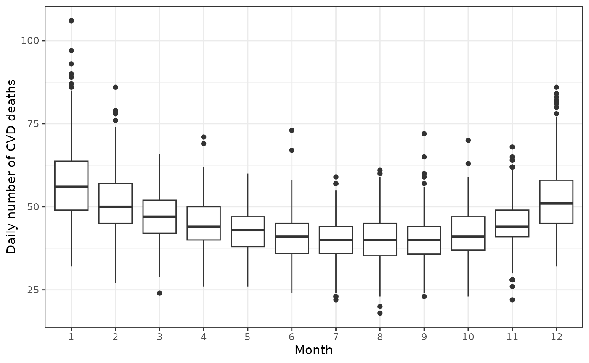
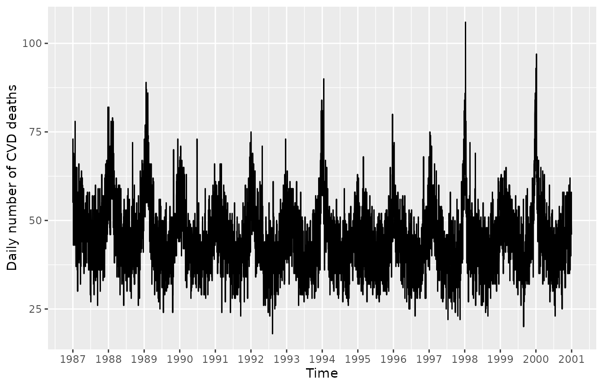
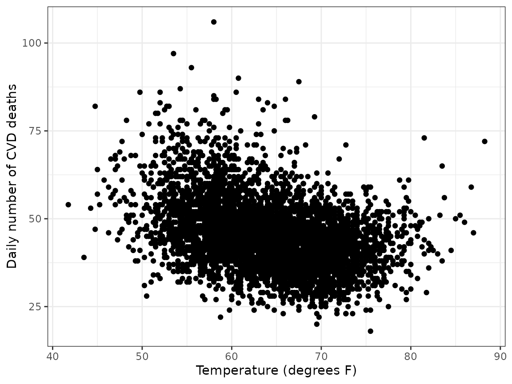
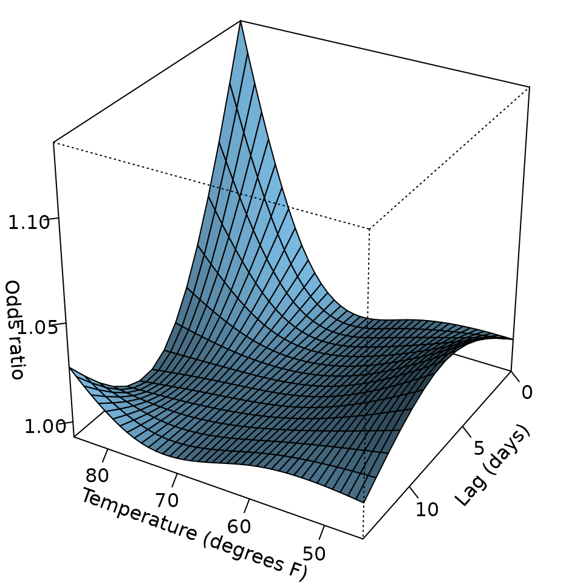
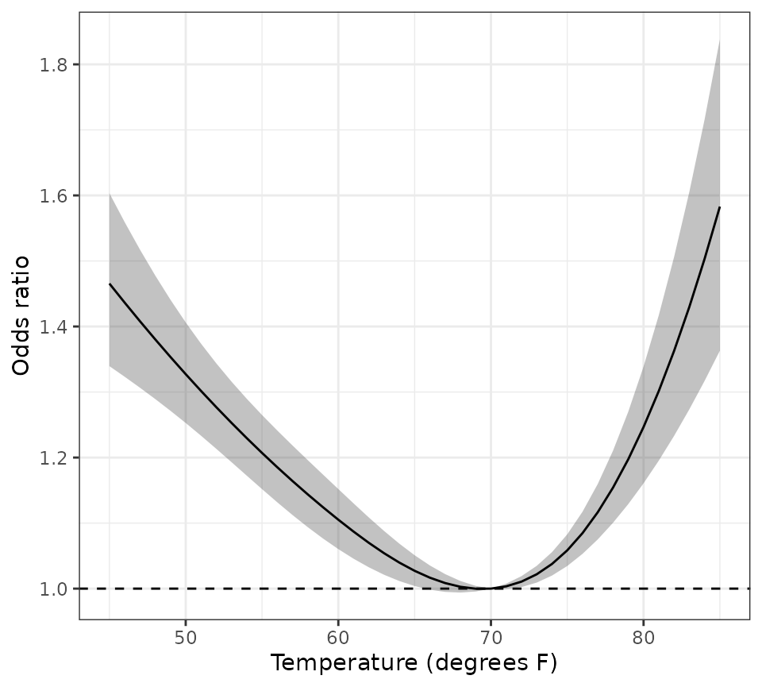
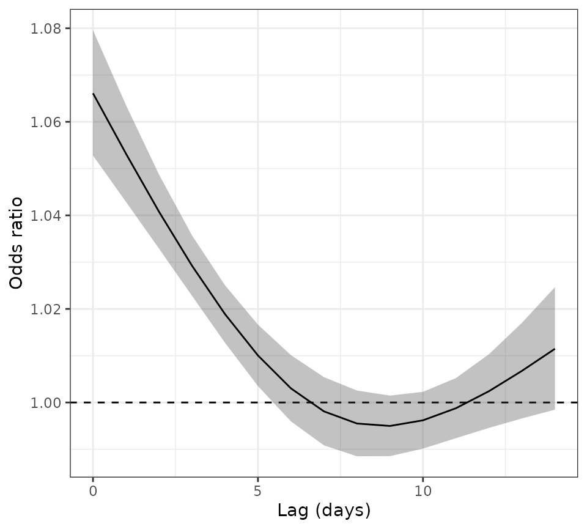
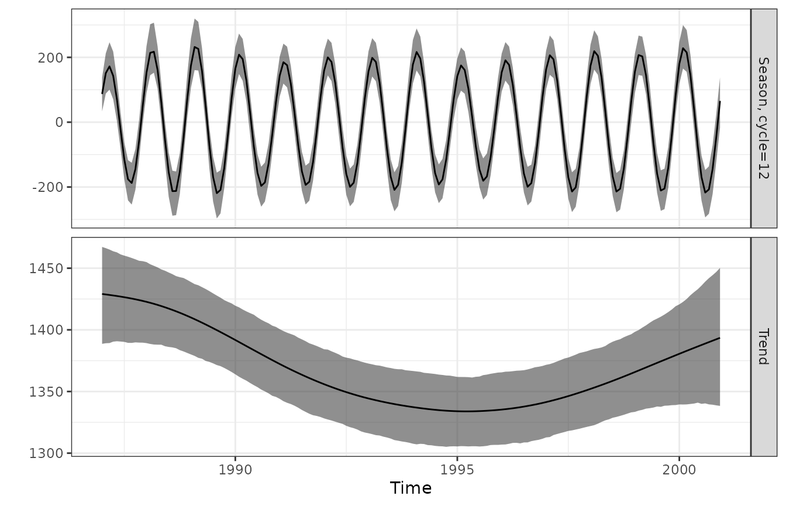
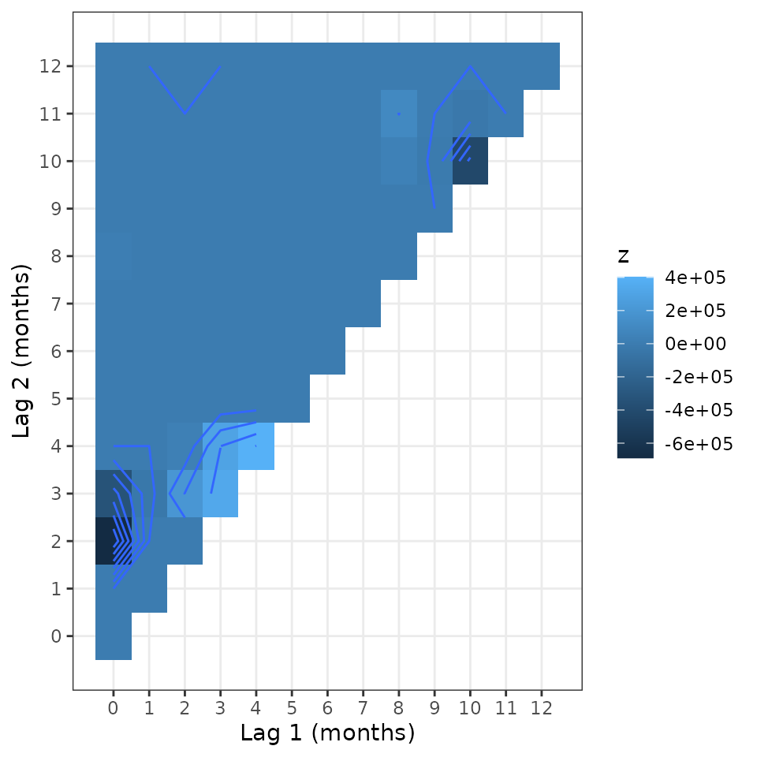

# Season tutorial

`season` is a package to analyse seasonal data that I developed whilst
working on studies in environmental epidemiology. Here I describe some
of the key functions.

## Seasonal death data

We will use the data on the daily number of deaths from cardiovascular
disease (CVD) in people aged 75 and over in Los Angeles for the years
1987 to 2000. Below we load the data and then use `ggplot2` to draw a
boxplot of the daily death counts by month.

``` r

data(CVDdaily)
ggplot(
  data = CVDdaily,
  aes(
    x = factor(month),
    y = cvd
  )
) +
  geom_boxplot() +
  labs(
    x = "Month",
    y = "Daily number of CVD deaths"
  ) +
  theme_bw()
```



There is a clear seasonal pattern, with more deaths in the winter months
and fewer in the summer. There’s also evidence of a greater variance in
the winter months, which we would expect in a count process, as the
variance is proportional to the mean.

### Plot of deaths over time

It is also useful to plot the data over time as below. To help show the
seasonal pattern, we create a vertical reference line for the first day
of each year. The plot shows the seasonal peak happened in every winter,
although the size of the peak varied between years.

``` r

years <- 1987:2001
Januarys <- paste0(years, "-01-01") |>
  as.Date(origin = "1970-01-01") |>
  as.numeric()

ggplot(
  CVDdaily,
  aes(
    x = as.numeric(date),
    y = cvd
  )
) +
  geom_line() +
  scale_x_continuous(
    breaks = Januarys,
    labels = years
  ) +
  labs(
    x = "Time",
    y = "Daily number of CVD deaths"
  )
```



``` r

theme_bw() +
  theme(panel.grid.minor = element_blank())
#> <theme> List of 144
#>  $ line                            : <ggplot2::element_line>
#>   ..@ colour       : chr "black"
#>   ..@ linewidth    : num 0.5
#>   ..@ linetype     : num 1
#>   ..@ lineend      : chr "butt"
#>   ..@ linejoin     : chr "round"
#>   ..@ arrow        : logi FALSE
#>   ..@ arrow.fill   : chr "black"
#>   ..@ inherit.blank: logi TRUE
#>  $ rect                            : <ggplot2::element_rect>
#>   ..@ fill         : chr "white"
#>   ..@ colour       : chr "black"
#>   ..@ linewidth    : num 0.5
#>   ..@ linetype     : num 1
#>   ..@ linejoin     : chr "round"
#>   ..@ inherit.blank: logi TRUE
#>  $ text                            : <ggplot2::element_text>
#>   ..@ family       : chr ""
#>   ..@ face         : chr "plain"
#>   ..@ italic       : chr NA
#>   ..@ fontweight   : num NA
#>   ..@ fontwidth    : num NA
#>   ..@ colour       : chr "black"
#>   ..@ size         : num 11
#>   ..@ hjust        : num 0.5
#>   ..@ vjust        : num 0.5
#>   ..@ angle        : num 0
#>   ..@ lineheight   : num 0.9
#>   ..@ margin       : <ggplot2::margin> num [1:4] 0 0 0 0
#>   ..@ debug        : logi FALSE
#>   ..@ inherit.blank: logi TRUE
#>  $ title                           : <ggplot2::element_text>
#>   ..@ family       : NULL
#>   ..@ face         : NULL
#>   ..@ italic       : chr NA
#>   ..@ fontweight   : num NA
#>   ..@ fontwidth    : num NA
#>   ..@ colour       : NULL
#>   ..@ size         : NULL
#>   ..@ hjust        : NULL
#>   ..@ vjust        : NULL
#>   ..@ angle        : NULL
#>   ..@ lineheight   : NULL
#>   ..@ margin       : NULL
#>   ..@ debug        : NULL
#>   ..@ inherit.blank: logi TRUE
#>  $ point                           : <ggplot2::element_point>
#>   ..@ colour       : chr "black"
#>   ..@ shape        : num 19
#>   ..@ size         : num 1.5
#>   ..@ fill         : chr "white"
#>   ..@ stroke       : num 0.5
#>   ..@ inherit.blank: logi TRUE
#>  $ polygon                         : <ggplot2::element_polygon>
#>   ..@ fill         : chr "white"
#>   ..@ colour       : chr "black"
#>   ..@ linewidth    : num 0.5
#>   ..@ linetype     : num 1
#>   ..@ linejoin     : chr "round"
#>   ..@ inherit.blank: logi TRUE
#>  $ geom                            : <ggplot2::element_geom>
#>   ..@ ink        : chr "black"
#>   ..@ paper      : chr "white"
#>   ..@ accent     : chr "#3366FF"
#>   ..@ linewidth  : num 0.5
#>   ..@ borderwidth: num 0.5
#>   ..@ linetype   : int 1
#>   ..@ bordertype : int 1
#>   ..@ family     : chr ""
#>   ..@ fontsize   : num 3.87
#>   ..@ pointsize  : num 1.5
#>   ..@ pointshape : num 19
#>   ..@ colour     : NULL
#>   ..@ fill       : NULL
#>  $ spacing                         : 'simpleUnit' num 5.5points
#>   ..- attr(*, "unit")= int 8
#>  $ margins                         : <ggplot2::margin> num [1:4] 5.5 5.5 5.5 5.5
#>  $ aspect.ratio                    : NULL
#>  $ axis.title                      : NULL
#>  $ axis.title.x                    : <ggplot2::element_text>
#>   ..@ family       : NULL
#>   ..@ face         : NULL
#>   ..@ italic       : chr NA
#>   ..@ fontweight   : num NA
#>   ..@ fontwidth    : num NA
#>   ..@ colour       : NULL
#>   ..@ size         : NULL
#>   ..@ hjust        : NULL
#>   ..@ vjust        : num 1
#>   ..@ angle        : NULL
#>   ..@ lineheight   : NULL
#>   ..@ margin       : <ggplot2::margin> num [1:4] 2.75 0 0 0
#>   ..@ debug        : NULL
#>   ..@ inherit.blank: logi TRUE
#>  $ axis.title.x.top                : <ggplot2::element_text>
#>   ..@ family       : NULL
#>   ..@ face         : NULL
#>   ..@ italic       : chr NA
#>   ..@ fontweight   : num NA
#>   ..@ fontwidth    : num NA
#>   ..@ colour       : NULL
#>   ..@ size         : NULL
#>   ..@ hjust        : NULL
#>   ..@ vjust        : num 0
#>   ..@ angle        : NULL
#>   ..@ lineheight   : NULL
#>   ..@ margin       : <ggplot2::margin> num [1:4] 0 0 2.75 0
#>   ..@ debug        : NULL
#>   ..@ inherit.blank: logi TRUE
#>  $ axis.title.x.bottom             : NULL
#>  $ axis.title.y                    : <ggplot2::element_text>
#>   ..@ family       : NULL
#>   ..@ face         : NULL
#>   ..@ italic       : chr NA
#>   ..@ fontweight   : num NA
#>   ..@ fontwidth    : num NA
#>   ..@ colour       : NULL
#>   ..@ size         : NULL
#>   ..@ hjust        : NULL
#>   ..@ vjust        : num 1
#>   ..@ angle        : num 90
#>   ..@ lineheight   : NULL
#>   ..@ margin       : <ggplot2::margin> num [1:4] 0 2.75 0 0
#>   ..@ debug        : NULL
#>   ..@ inherit.blank: logi TRUE
#>  $ axis.title.y.left               : NULL
#>  $ axis.title.y.right              : <ggplot2::element_text>
#>   ..@ family       : NULL
#>   ..@ face         : NULL
#>   ..@ italic       : chr NA
#>   ..@ fontweight   : num NA
#>   ..@ fontwidth    : num NA
#>   ..@ colour       : NULL
#>   ..@ size         : NULL
#>   ..@ hjust        : NULL
#>   ..@ vjust        : num 1
#>   ..@ angle        : num -90
#>   ..@ lineheight   : NULL
#>   ..@ margin       : <ggplot2::margin> num [1:4] 0 0 0 2.75
#>   ..@ debug        : NULL
#>   ..@ inherit.blank: logi TRUE
#>  $ axis.text                       : <ggplot2::element_text>
#>   ..@ family       : NULL
#>   ..@ face         : NULL
#>   ..@ italic       : chr NA
#>   ..@ fontweight   : num NA
#>   ..@ fontwidth    : num NA
#>   ..@ colour       : chr "#4D4D4DFF"
#>   ..@ size         : 'rel' num 0.8
#>   ..@ hjust        : NULL
#>   ..@ vjust        : NULL
#>   ..@ angle        : NULL
#>   ..@ lineheight   : NULL
#>   ..@ margin       : NULL
#>   ..@ debug        : NULL
#>   ..@ inherit.blank: logi TRUE
#>  $ axis.text.x                     : <ggplot2::element_text>
#>   ..@ family       : NULL
#>   ..@ face         : NULL
#>   ..@ italic       : chr NA
#>   ..@ fontweight   : num NA
#>   ..@ fontwidth    : num NA
#>   ..@ colour       : NULL
#>   ..@ size         : NULL
#>   ..@ hjust        : NULL
#>   ..@ vjust        : num 1
#>   ..@ angle        : NULL
#>   ..@ lineheight   : NULL
#>   ..@ margin       : <ggplot2::margin> num [1:4] 2.2 0 0 0
#>   ..@ debug        : NULL
#>   ..@ inherit.blank: logi TRUE
#>  $ axis.text.x.top                 : <ggplot2::element_text>
#>   ..@ family       : NULL
#>   ..@ face         : NULL
#>   ..@ italic       : chr NA
#>   ..@ fontweight   : num NA
#>   ..@ fontwidth    : num NA
#>   ..@ colour       : NULL
#>   ..@ size         : NULL
#>   ..@ hjust        : NULL
#>   ..@ vjust        : num 0
#>   ..@ angle        : NULL
#>   ..@ lineheight   : NULL
#>   ..@ margin       : <ggplot2::margin> num [1:4] 0 0 2.2 0
#>   ..@ debug        : NULL
#>   ..@ inherit.blank: logi TRUE
#>  $ axis.text.x.bottom              : NULL
#>  $ axis.text.y                     : <ggplot2::element_text>
#>   ..@ family       : NULL
#>   ..@ face         : NULL
#>   ..@ italic       : chr NA
#>   ..@ fontweight   : num NA
#>   ..@ fontwidth    : num NA
#>   ..@ colour       : NULL
#>   ..@ size         : NULL
#>   ..@ hjust        : num 1
#>   ..@ vjust        : NULL
#>   ..@ angle        : NULL
#>   ..@ lineheight   : NULL
#>   ..@ margin       : <ggplot2::margin> num [1:4] 0 2.2 0 0
#>   ..@ debug        : NULL
#>   ..@ inherit.blank: logi TRUE
#>  $ axis.text.y.left                : NULL
#>  $ axis.text.y.right               : <ggplot2::element_text>
#>   ..@ family       : NULL
#>   ..@ face         : NULL
#>   ..@ italic       : chr NA
#>   ..@ fontweight   : num NA
#>   ..@ fontwidth    : num NA
#>   ..@ colour       : NULL
#>   ..@ size         : NULL
#>   ..@ hjust        : num 0
#>   ..@ vjust        : NULL
#>   ..@ angle        : NULL
#>   ..@ lineheight   : NULL
#>   ..@ margin       : <ggplot2::margin> num [1:4] 0 0 0 2.2
#>   ..@ debug        : NULL
#>   ..@ inherit.blank: logi TRUE
#>  $ axis.text.theta                 : NULL
#>  $ axis.text.r                     : <ggplot2::element_text>
#>   ..@ family       : NULL
#>   ..@ face         : NULL
#>   ..@ italic       : chr NA
#>   ..@ fontweight   : num NA
#>   ..@ fontwidth    : num NA
#>   ..@ colour       : NULL
#>   ..@ size         : NULL
#>   ..@ hjust        : num 0.5
#>   ..@ vjust        : NULL
#>   ..@ angle        : NULL
#>   ..@ lineheight   : NULL
#>   ..@ margin       : <ggplot2::margin> num [1:4] 0 2.2 0 2.2
#>   ..@ debug        : NULL
#>   ..@ inherit.blank: logi TRUE
#>  $ axis.ticks                      : <ggplot2::element_line>
#>   ..@ colour       : chr "#333333FF"
#>   ..@ linewidth    : NULL
#>   ..@ linetype     : NULL
#>   ..@ lineend      : NULL
#>   ..@ linejoin     : NULL
#>   ..@ arrow        : logi FALSE
#>   ..@ arrow.fill   : chr "#333333FF"
#>   ..@ inherit.blank: logi TRUE
#>  $ axis.ticks.x                    : NULL
#>  $ axis.ticks.x.top                : NULL
#>  $ axis.ticks.x.bottom             : NULL
#>  $ axis.ticks.y                    : NULL
#>  $ axis.ticks.y.left               : NULL
#>  $ axis.ticks.y.right              : NULL
#>  $ axis.ticks.theta                : NULL
#>  $ axis.ticks.r                    : NULL
#>  $ axis.minor.ticks.x.top          : NULL
#>  $ axis.minor.ticks.x.bottom       : NULL
#>  $ axis.minor.ticks.y.left         : NULL
#>  $ axis.minor.ticks.y.right        : NULL
#>  $ axis.minor.ticks.theta          : NULL
#>  $ axis.minor.ticks.r              : NULL
#>  $ axis.ticks.length               : 'rel' num 0.5
#>  $ axis.ticks.length.x             : NULL
#>  $ axis.ticks.length.x.top         : NULL
#>  $ axis.ticks.length.x.bottom      : NULL
#>  $ axis.ticks.length.y             : NULL
#>  $ axis.ticks.length.y.left        : NULL
#>  $ axis.ticks.length.y.right       : NULL
#>  $ axis.ticks.length.theta         : NULL
#>  $ axis.ticks.length.r             : NULL
#>  $ axis.minor.ticks.length         : 'rel' num 0.75
#>  $ axis.minor.ticks.length.x       : NULL
#>  $ axis.minor.ticks.length.x.top   : NULL
#>  $ axis.minor.ticks.length.x.bottom: NULL
#>  $ axis.minor.ticks.length.y       : NULL
#>  $ axis.minor.ticks.length.y.left  : NULL
#>  $ axis.minor.ticks.length.y.right : NULL
#>  $ axis.minor.ticks.length.theta   : NULL
#>  $ axis.minor.ticks.length.r       : NULL
#>  $ axis.line                       : <ggplot2::element_blank>
#>  $ axis.line.x                     : NULL
#>  $ axis.line.x.top                 : NULL
#>  $ axis.line.x.bottom              : NULL
#>  $ axis.line.y                     : NULL
#>  $ axis.line.y.left                : NULL
#>  $ axis.line.y.right               : NULL
#>  $ axis.line.theta                 : NULL
#>  $ axis.line.r                     : NULL
#>  $ legend.background               : <ggplot2::element_rect>
#>   ..@ fill         : NULL
#>   ..@ colour       : logi NA
#>   ..@ linewidth    : NULL
#>   ..@ linetype     : NULL
#>   ..@ linejoin     : NULL
#>   ..@ inherit.blank: logi TRUE
#>  $ legend.margin                   : NULL
#>  $ legend.spacing                  : 'rel' num 2
#>  $ legend.spacing.x                : NULL
#>  $ legend.spacing.y                : NULL
#>  $ legend.key                      : NULL
#>  $ legend.key.size                 : 'simpleUnit' num 1.2lines
#>   ..- attr(*, "unit")= int 3
#>  $ legend.key.height               : NULL
#>  $ legend.key.width                : NULL
#>  $ legend.key.spacing              : NULL
#>  $ legend.key.spacing.x            : NULL
#>  $ legend.key.spacing.y            : NULL
#>  $ legend.key.justification        : NULL
#>  $ legend.frame                    : NULL
#>  $ legend.ticks                    : NULL
#>  $ legend.ticks.length             : 'rel' num 0.2
#>  $ legend.axis.line                : NULL
#>  $ legend.text                     : <ggplot2::element_text>
#>   ..@ family       : NULL
#>   ..@ face         : NULL
#>   ..@ italic       : chr NA
#>   ..@ fontweight   : num NA
#>   ..@ fontwidth    : num NA
#>   ..@ colour       : NULL
#>   ..@ size         : 'rel' num 0.8
#>   ..@ hjust        : NULL
#>   ..@ vjust        : NULL
#>   ..@ angle        : NULL
#>   ..@ lineheight   : NULL
#>   ..@ margin       : NULL
#>   ..@ debug        : NULL
#>   ..@ inherit.blank: logi TRUE
#>  $ legend.text.position            : NULL
#>  $ legend.title                    : <ggplot2::element_text>
#>   ..@ family       : NULL
#>   ..@ face         : NULL
#>   ..@ italic       : chr NA
#>   ..@ fontweight   : num NA
#>   ..@ fontwidth    : num NA
#>   ..@ colour       : NULL
#>   ..@ size         : NULL
#>   ..@ hjust        : num 0
#>   ..@ vjust        : NULL
#>   ..@ angle        : NULL
#>   ..@ lineheight   : NULL
#>   ..@ margin       : NULL
#>   ..@ debug        : NULL
#>   ..@ inherit.blank: logi TRUE
#>  $ legend.title.position           : NULL
#>  $ legend.position                 : chr "right"
#>  $ legend.position.inside          : NULL
#>  $ legend.direction                : NULL
#>  $ legend.byrow                    : NULL
#>  $ legend.justification            : chr "center"
#>  $ legend.justification.top        : NULL
#>  $ legend.justification.bottom     : NULL
#>  $ legend.justification.left       : NULL
#>  $ legend.justification.right      : NULL
#>  $ legend.justification.inside     : NULL
#>   [list output truncated]
#>  @ complete: logi TRUE
#>  @ validate: logi TRUE
```

### Daily deaths and temperatures plot

Deaths increase in many countries around the world when the temperature
is outside an optimal range, with the optimal range varying by climate.
The plot below shows daily death counts against daily temperatures.
Increases in deaths are apparent at both low and high temperatures,
suggesting a non-linear association between temperature and
cardiovascular deaths.

``` r

ggplot(
  CVDdaily,
  aes(
    x = tmpd,
    y = cvd
  )
) +
  geom_point() +
  labs(
    x = "Temperature (degrees F)",
    y = "Daily number of CVD deaths"
  ) +
  theme_bw()
```



## Regression model

We now examine the association between temperature and death using a
case-crossover model. This model compares the number of deaths on case
and control days, and only uses controls that are near the case day. By
choosing control days near case days, the model controls for long-term
trends and seasonal patterns. Below we use the default of cases and
controls selected from the same 28 day (4 week) windows. The model is
fitted using conditional logistic regression. The technical details are
in our book [Analysing Seasonal Health
Data](https://link.springer.com/book/10.1007/978-3-642-10748-1).

To model a non-linear effect for temperature, we first create a spline
for temperature with knots at 60 and 75 degrees Fahrenheit, which
essentially means we expect a change in the association around these
temperatures.

Deaths due to temperature can occur days after exposure. For example,
when a person has a heart attack on a hot day, is admitted to hospital
alive, but dies in hospital some days later. To account for this we
include a lag of 14 days. By using a lagged temperature we lose a few
observations at the start of the data, because we do not have
temperature data from the year 1986. We use the
`[dlnm](https://cran.r-project.org/web/packages/dlnm/index.html)`
library to create the non-linear and lagged spline basis.

We include a categorical variable of day of the week, because there is
evidence that deaths vary by day of the week.

The model takes a short while to run.

``` r

# make a spline basis that has a lag and is non-linear
tmpd.basis <- crossbasis(
  CVDdaily$tmpd,
  # 14 day lag
  lag = 14,
  # 3 degrees of freedom for lag; ns = natural spline
  arglag = list(fun = "ns", df = 3),
  # knots at 65 and 75 degrees
  argvar = list(fun = "ns", knots = c(60, 75))
)
# add the spline basis variables to the data
CVDdaily <- cbind(CVDdaily, tmpd.basis[seq_len(nrow(CVDdaily)), ])
# create the regression formula
spline.names <- colnames(tmpd.basis)
formula <- paste(
  "cvd ~",
  paste(spline.names, collapse = " + "),
  "+ Mon + Tue + Wed + Thu + Fri + Sat"
)
model <- casecross(stats::as.formula(formula), data = CVDdaily)
summary(model)
#> Time-stratified case-crossover with a stratum length of 28 days
#> Total number of cases 229759 
#> Number of case days with available control days 5098 
#> Average number of control days per case day 23.2 
#> 
#> Parameter Estimates:
#>               coef exp(coef)    se(coef)          z     Pr(>|z|)
#> v1.l1 -0.020874306 0.9793421 0.011889922 -1.7556303 7.915156e-02
#> v1.l2 -0.066362396 0.9357917 0.008656561 -7.6661383 1.772520e-14
#> v1.l3  0.002178049 1.0021804 0.008944090  0.2435182 8.076040e-01
#> v2.l1 -0.191012092 0.8261226 0.038352025 -4.9804957 6.342163e-07
#> v2.l2  0.014749261 1.0148586 0.029740115  0.4959383 6.199380e-01
#> v2.l3 -0.014302130 0.9857997 0.029749686 -0.4807490 6.306949e-01
#> v3.l1 -0.150126292 0.8605993 0.023333994 -6.4338019 1.244511e-10
#> v3.l2  0.117420420 1.1245921 0.017741751  6.6183107 3.633268e-11
#> v3.l3 -0.058042887 0.9436095 0.018876807 -3.0748254 2.106258e-03
#> Mon    0.036431253 1.0371030 0.007820245  4.6585818 3.183953e-06
#> Tue    0.018269159 1.0184371 0.007841133  2.3299131 1.981074e-02
#> Wed   -0.011365776 0.9886986 0.007868064 -1.4445454 1.485856e-01
#> Thu   -0.008998068 0.9910423 0.007856868 -1.1452488 2.521061e-01
#> Fri    0.009599729 1.0096460 0.007855806  1.2219916 2.217108e-01
#> Sat    0.014931771 1.0150438 0.007861585  1.8993336 5.752063e-02
```

This is a large study with just under 230,000 deaths and over 5,000 case
days. The coefficients are the log odds ratios. Here and elsewhere in
this vignette, the estimates are quoted to many decimal places, but when
presented in a paper we recommend using [these
guidelines](https://adc.bmj.com/content/100/7/608).

We can see there are more deaths on Monday compared with the reference
day of Sunday. The temperature estimates are hard to interpret and are
best shown by reconstructing the nine spline estimates in a plot.

#### Confidence intervals

The display above does not give confidence intervals for the log odds
ratios, but these can easily be created as follows (which gives 95%
confidence intervals).

``` r

confint(model$cox_model)
#>               2.5 %       97.5 %
#> v1.l1 -0.0441781242  0.002429512
#> v1.l2 -0.0833289446 -0.049395848
#> v1.l3 -0.0153520450  0.019708143
#> v2.l1 -0.2661806785 -0.115843505
#> v2.l2 -0.0435402932  0.073038815
#> v2.l3 -0.0726104439  0.044006183
#> v3.l1 -0.1958600798 -0.104392505
#> v3.l2  0.0826472273  0.152193613
#> v3.l3 -0.0950407498 -0.021045024
#> Mon    0.0211038533  0.051758652
#> Tue    0.0029008204  0.033637498
#> Wed   -0.0267868986  0.004055347
#> Thu   -0.0243972457  0.006401110
#> Fri   -0.0057973676  0.024996826
#> Sat   -0.0004766513  0.030340194
```

### Plot of the non-linear association between temperature and death

We use the coefficients and their variance–covariance matrix to
reconstruct a three-dimensional plot by lag and temperature. We examine
temperatures over the range 45 to 85 degrees Fahrenheit. The estimates
are centred using a reference temperature of 70 degrees.

``` r

# extract the coefficients and variance--covariance matrix for the spline terms
coef <- coefficients(model$cox_model)
index <- names(coef) %in% spline.names
coef <- coef[index]
vcov <- vcov(model$cox_model)[index, index]
for.plot <- crosspred(
  basis = tmpd.basis,
  coef = coef,
  vcov = vcov,
  at = seq(45, 85, 1),
  model.link = "log",
  cen = 70
)
par(mai = c(0.2, 0, 0, 0)) # reduce plot margins
plot(
  for.plot,
  xlab = "Temperature (degrees F)",
  zlab = "Odds ratio",
  ylab = "Lag (days)"
)
```



The dominant feature is a large spike in deaths at high temperatures on
the same day of exposure (lag day zero).

### Plot of the temperature and death association averaging over all lags

Another useful plot is the overall change in risk which summarises the
results across all lags. The plot shows the mean odds (solid line) and
95% confidence interval (shaded area). We first put the estimates into a
`data.frame` so they can be used in `ggplot2`.

``` r

to.plot <- data.frame(
  temperature = for.plot$predvar,
  mean = for.plot$allRRfit,
  lower = for.plot$allRRlow,
  upper = for.plot$allRRhigh
)
ggplot(
  data = to.plot,
  aes(
    x = temperature,
    y = mean,
    ymin = lower,
    ymax = upper
  )
) +
  geom_hline(
    lty = 2,
    yintercept = 1
  ) + # horizontal reference line at no change in odds
  geom_ribbon(alpha = 0.3) +
  geom_line() +
  labs(
    x = "Temperature (degrees F)",
    y = "Odds ratio"
  ) +
  theme_bw()
```



### Plot of the lagged temperature and death association for a specific temperature

We can also take a “slice” of the 3D plot to show the association on
each lagged day. The plot shows the mean odds (solid line) and 95%
confidence interval (shaded area).

``` r

for.plot <- crosspred(
  basis = tmpd.basis,
  coef = coef,
  vcov = vcov,
  at = 80,
  lag = c(0, 14),
  model.link = "log",
  cen = 70
)
to.plot <- data.frame(
  lag = for.plot$lag[1]:for.plot$lag[2],
  mean = as.numeric(for.plot$matRRfit),
  lower = as.numeric(for.plot$matRRlow),
  upper = as.numeric(for.plot$matRRhigh)
)
ggplot(
  data = to.plot,
  aes(
    x = lag,
    y = mean,
    ymin = lower,
    ymax = upper
  )
) +
  geom_hline(
    lty = 2,
    yintercept = 1
  ) + # horizontal reference line at no change in odds
  geom_ribbon(alpha = 0.3) +
  geom_line() +
  labs(
    x = "Lag (days)",
    y = "Odds ratio"
  ) +
  theme_bw()
```



The plot shows that the estimated risk is highest on the day of exposure
and generally declines with increasing lag.

## Non-stationary seasonal patterns

As shown in the second plot in this vignette, the seasonal pattern
appeared to vary from year-to-year, with larger peaks in some years.
This is a non-stationary seasonal pattern. We can model this pattern by
splitting the time series into a trend, seasonal pattern(s) and
residuals. Details on the method are available in this paper:
[Estimating trends and seasonality in coronary heart
disease](https://onlinelibrary.wiley.com/doi/10.1002/sim.1927).

We use the monthly data rather than the daily data because we are
primarily interested in seasonal patterns, and the daily data will take
much longer to run. We use the response variable of `adj` as this is the
adjusted monthly counts of CVD deaths which accounts for the differences
in month lengths (e.g., 28 or 29 days in February and 31 in January).

This model takes a few minutes to run because it uses Markov chain Monte
Carlo samples to estimate the model parameters.

``` r

set.seed(1234) # set the random seed to give repeatable results
f <- 12 # a single twelve month cycle
tau <- c(10, 50) # achieved via trial-and-error; small tau -> less variability
ns.season <- nscosinor(
  data = CVD,
  response = "adj",
  cycles = f,
  niters = 2000,
  burnin = 500,
  tau = tau,
  div = 1000
)
#> Iteration number 1000 of 2000 Iteration number 2000 of 2000 
summary(ns.season)
#> Statistics for non-stationary cosinor based on MCMC chains
#> Number of MCMC samples = 1501
#> 
#> Standard deviations
#> Residual, mean=113.402, 95% CI [100.492, 127.221]
#> Cycle=12
#> Season, mean=0.157644, 95% CI [0.0446635, 0.319579]
#> 
#> Phase and amplitude
#> Cycle=12
#> Amplitude, mean=205.995, 95% CI [180.267, 233.145]
#> Phase (radians), mean=0.69756, 95% CI [0.579905, 0.829052]
plot(ns.season)
```



The estimated mean amplitude is 207, so on average there 207 extra
deaths per month in the seasonal winter peak compared with the
year-round average. The 95% confidence interval for the peak is from 182
to 232 monthly deaths.

The plot shows the long-term non-linear trend and non-stationary
seasonal pattern. The seasonal peaks are higher in some years, including
1989 and 2000, which matches the above plot of the data.

#### Back transforming the phase

The phase, or timing of the seasonal peak, in the results above is given
in radians (on a scale of 0 to 2$`\pi`$). We can transform this to a
more useful time scale by transforming the summary statistics.

``` r

cat(
  "Mean phase = ",
  round(invyrfraction(0.6952055 / (2 * pi), type = "monthly", text = FALSE), 2),
  " months.\n",
  sep = ""
)
#> Mean phase = 2.33 months.
cat(
  "Lower 95% interval = ",
  round(invyrfraction(0.5732958 / (2 * pi), type = "monthly", text = FALSE), 2),
  " months.\n",
  sep = ""
)
#> Lower 95% interval = 2.09 months.
cat(
  "Upper 95% interval = ",
  round(invyrfraction(0.8216251 / (2 * pi), type = "monthly", text = FALSE), 2),
  " months.\n",
  sep = ""
)
#> Upper 95% interval = 2.57 months.
```

The estimated peak in deaths is in early February.

## Testing for non-linearity in time series

Another useful function is a test of non-linearity in time series using
the third-order moment. This is the non-linear extension of the more
familiar second-order tests of linearity, such as the autocorrelation
function. Here we check for any remaining non-linearity in the time
series of residuals from the non-stationary model of the seasonal
pattern in monthly CVD deaths. We check up to a lag of 12 months.

``` r

set.seed(1234) # set the random seed to give repeatable results
ntest.residuals <- nonlintest(
  ns.season$residuals,
  n.lag = 12,
  n.boot = 500
)
ntest.residuals
#> Largest and smallest co-ordinates of the third-order moment outside the test limits
#> Largest positive difference at lags:
#> 4 4 
#> Size of largest largest difference:
#> 402602.8 
#> Largest negative difference at lags:
#> 0 2 
#> Size of largest negative difference:
#> -689838.6 
#> 
#> Bootstrap test of non-linearity using the third-order moment
#> Statistics for areas outside test limits:
#> observed     obs/SD     median-null    95%-null    p-value
#> 2961568 7.056636 283627.3 1253176 0
```

There is evidence of remaining non-linearity in the residuals at lags of
2 to 4 months.

``` r

plot <- plot(
  ntest.residuals,
  plot = FALSE
)
#> Warning: `plot.nonlintest()` was deprecated in season 0.3.17.
#> Use `autoplot()` for a ggplot object you can extend:
#> ℹ  autoplot(x) + ggplot2::theme_bw()
#> This warning is displayed once per session.
#> Call `lifecycle::last_lifecycle_warnings()` to see where this warning was
#> generated.
#> Warning: The `plot` argument of `plot.nonlintest()` is deprecated as of season 0.3.17.
#> ℹ Assign the return value of `autoplot(x)` instead.
#> This warning is displayed once per session.
#> Call `lifecycle::last_lifecycle_warnings()` to see where this warning was
#> generated.
plot +
  scale_x_continuous(breaks = 0:12) +
  scale_y_continuous(breaks = 0:12) +
  theme_bw() +
  labs(
    x = "Lag 1 (months)",
    y = "Lag 2 (months)"
  ) +
  theme(panel.grid.minor = element_blank())
```



The plot of the third order moment shows the lags with the strongest
non-linear interactions at (0,2), (4,4) and (10,10).
